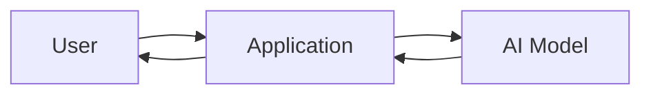
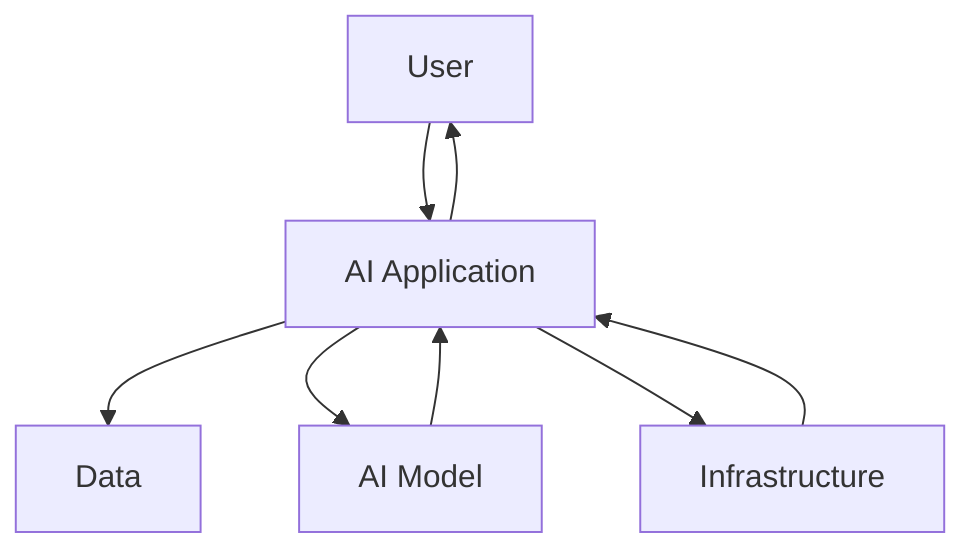

> [!abstract] Definition  
> **AI Engineering** is the practice of building, integrating, deploying, and maintaining software systems that use AI models.

A simple way to think about it is:

> **AI Engineering = Software Engineering + AI**

An AI engineer doesn't only work with the AI model. They also build the **software and systems around the model** so that people can actually use it.

## A Simple Example

Imagine you want to build a chatbot for a company.

The AI model is an important part of the chatbot, but it isn't the entire application.



The application might need to handle things such as:

- Sending the user's question to the model
- Giving the model the right information
- Receiving the model's response
- Showing the response to the user
- Handling errors
- Keeping the system fast
- Deploying the application
- Monitoring whether it works correctly

The **AI model is one component of the system**.

## AI Engineer vs AI Model

This distinction is important.

A researcher might focus on creating or improving a model:

```text
Data
 ↓
Model
 ↓
Training
 ↓
Better Model
```

An AI engineer often focuses on using that model inside a real application:

```text
User
 ↓
Application
 ↓
AI Model
 ↓
Application
 ↓
User
```

In real projects, these responsibilities can overlap. An AI engineer may also train, fine-tune, evaluate, or optimize models.

## What Does an AI Engineer Work With?

Over time, an AI engineer may work with:

```text
AI Engineering
│
├── AI Models
├── Data
├── Python / Software
├── APIs
├── Databases
├── GPUs
├── Model Inference
├── Deployment
└── Monitoring
```

You don't need to understand these things yet. We'll learn them one by one.

## The Big Picture

The main difference between simply **using an AI model** and **AI Engineering** is the system around the model.



The goal of AI Engineering is to turn AI capabilities into **useful, reliable software systems**.

> [!important] Remember  
> **AI Engineering is about building real software systems that use AI models.**

You don't need to learn deployment, GPUs, APIs, or model optimization yet. Those topics will come later in the roadmap.

Next: [[AI Engineering vs ML Engineering vs Data Science]].