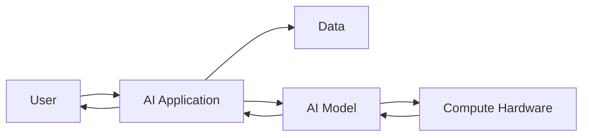
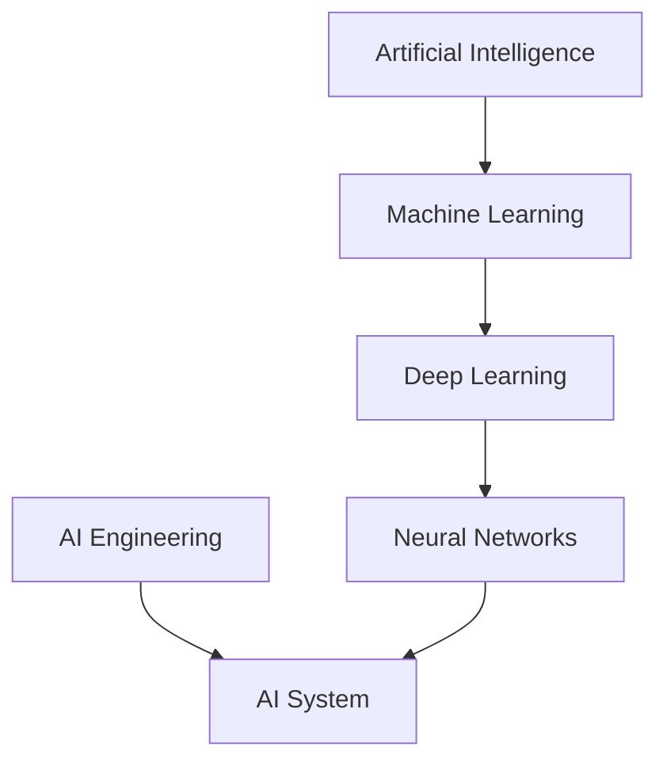

> [!abstract] Overview  
> An **AI system** is more than just an AI model. It is a collection of software, data, models, and infrastructure working together to provide an AI-powered capability.

When you use an AI application, you usually see only the final result. Behind that result, several components may be working together.

A simple AI system can look like this:


For example, you send a question to an AI chatbot. The application receives your question, sends the relevant information to an AI model, receives the model's output, and then shows the response to you.

## A More Complete Picture

As systems become more useful, more components are added.



Here, each part has a simple job.

**AI Application** is the software the user interacts with.

**Data** provides information that the system may need.

**AI Model** processes the input and produces a prediction or generated output.

**Compute Hardware** such as CPUs and GPUs performs the calculations required by the model.

You will learn each of these pieces later.

## The AI Engineering View

As an AI engineer, you should gradually learn to see an AI application as a **system**, rather than thinking only about the model.

For example:

```text
User
 ↓
Application
 ↓
Data
 ↓
AI Model
 ↓
Hardware
 ↓
Result
 ↓
Application
 ↓
User
```

The model is important, but the surrounding system is what turns the model into a usable product.

> [!important] Remember  
> **An AI model is a component of an AI system. AI Engineering is concerned with building the complete system around AI capabilities.**

This completes **Phase 1 — Foundations**.

### Phase 1 Mental Model



You now have the basic vocabulary:

**AI → Machine Learning → Deep Learning → Neural Networks**

and:

**AI Engineering → building systems that use these AI capabilities.**

Next, we'll move into **Phase 2 — Machine Learning Fundamentals**, starting with [[Data]].