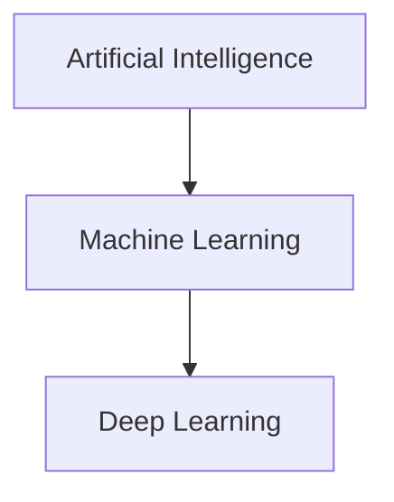

> [!abstract] Definition  
> **Artificial Intelligence (AI)** is the field of making computers perform tasks that normally require human intelligence.

Humans can do things like recognize objects, understand language, solve problems, make decisions, and learn from experience. AI tries to make computers capable of performing some of these tasks.

For example, when a computer recognizes a face in a photo, translates a sentence, recommends a movie, or answers a question, it is performing an AI-related task.

## AI, Machine Learning, and Deep Learning

You will often hear these three terms together. For now, remember this simple relationship:



**AI** is the big field. **Machine Learning** is one way of building AI systems by allowing computers to learn patterns from data. **Deep Learning** is a type of machine learning that uses neural networks.

We will learn Machine Learning and Deep Learning separately, so you don't need to understand them deeply yet.

## A Simple Example

Imagine we want a computer to recognize cats in pictures.

```text
Picture
   ↓
   AI
   ↓
Cat / Not Cat
```

The goal is to make the computer perform a task that is easy for humans but requires a computer system to process information and make a decision.

## AI Engineering Connection

As an **AI Engineer**, you will learn how to take these AI capabilities and turn them into useful software systems.

For now, the only idea you need to remember is:

> **AI is about building computer systems that can perform tasks that require intelligence.**

That's enough for this page. We can add more detail later when the surrounding concepts make it easier to understand.