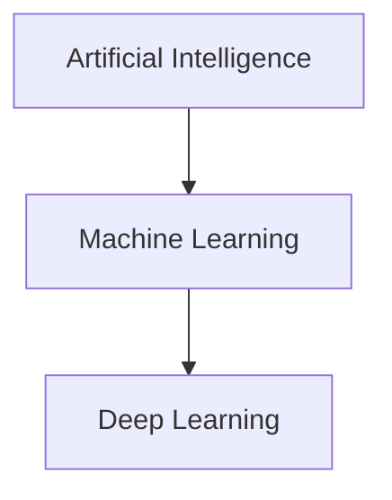

> [!abstract] Definition  
> **Deep Learning (DL)** is a type of machine learning that uses **neural networks with many layers** to learn patterns from data.

The main difference is that traditional machine-learning systems often depend more on humans to decide which useful features to give the model. Deep learning can learn many of those useful representations automatically from the data.



## A Simple Example

Imagine we want a computer to recognize whether an image contains a cat.

With a traditional approach, humans might design features such as:

```text
Edges
Shapes
Textures
Colors
```

The machine-learning model then uses those features to make a prediction.

With deep learning, we can give the neural network the **raw image** and let it learn useful patterns by itself.


Inside the network, different layers can gradually learn different types of patterns.

A simplified idea is:

```text
Image
  ↓
Simple patterns
  ↓
Shapes
  ↓
Parts of objects
  ↓
Object
  ↓
Prediction
```

We don't need to understand how these layers work yet. That's what the **Neural Networks** section will cover.

## Why Is It Called "Deep"?

A neural network can contain multiple layers.

```text
Input
  ↓
Layer 1
  ↓
Layer 2
  ↓
Layer 3
  ↓
Layer 4
  ↓
Output
```

A network with many layers is called a **deep neural network**, and the process of using these networks is called **deep learning**.

The word _deep_ mainly refers to the **depth of the network**, meaning how many layers of computation it has.

## Deep Learning in Modern AI

Deep learning is behind many modern AI systems, including:

- Image recognition
    
- Speech recognition
    
- Machine translation
    
- Large language models
    
- Image generation
    
- Recommendation systems
    
- Autonomous systems
    

For example, modern LLMs are based on deep-learning architectures called **Transformers**.

We'll learn about Transformers much later. For now, just remember that they are a type of deep-learning architecture.

> [!important] Remember  
> **Deep Learning is a type of machine learning that uses multi-layer neural networks to learn complex patterns from data.**

The relationship you should remember is:

```text
Artificial Intelligence
        ↓
Machine Learning
        ↓
Deep Learning
        ↓
Neural Networks
```

Next: [[AI Engineering]].