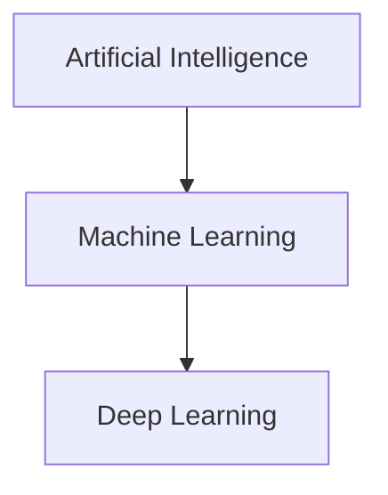

> [!abstract] Purpose  
> This phase builds the basic mental model needed to understand **AI Engineering**. It introduces AI, Machine Learning, Deep Learning, and the role of an AI Engineer before moving into the technical foundations.

The goal of this phase is not to learn how models work internally yet. It is simply to understand **what these things are and how they relate to each other**.

---

## Learning Path

### 01. [[Artificial Intelligence (AI)]]

The broad field of creating computer systems that can perform tasks that normally require human intelligence.

**Key idea:** AI is the big field that includes areas such as Machine Learning and Deep Learning.

---

### 02. [[Machine Learning (ML)]]

A way of building AI systems that allows computers to learn patterns from data instead of being given every rule explicitly.

**Key idea:** Machine Learning learns patterns from data and uses those patterns to make predictions or decisions.

---

### 03. [[Deep Learning (DL)]]

A type of Machine Learning that uses multi-layer neural networks to learn complex patterns from data.

**Key idea:** Deep Learning is a major technology behind many modern AI systems.

---

### 04. [[AI Engineering]]

The practice of building software systems that use AI models to provide useful functionality.

**Key idea:** An AI model is only one part of an AI application. AI Engineering focuses on building the system around it.

---

### 05. [[AI Engineering vs ML Engineering vs Data Science]]

A comparison of three closely related areas and the different problems they typically focus on.

**Key idea:** Data Science focuses heavily on data and insights, ML Engineering focuses on machine-learning models and their lifecycle, while AI Engineering focuses on building applications and systems using AI capabilities.

---

### 06. [[AI System — Big Picture]]

A high-level view of how the different parts of an AI system work together.

**Key idea:** A real AI system contains more than just a model. It can include applications, data, models, hardware, APIs, infrastructure, and other components.

---

## Foundation Mental Model

The most important relationship from this phase is:

And from the engineering perspective:

The first diagram explains the relationship between **AI, Machine Learning, and Deep Learning**.

The second gives a simple picture of an **AI system**, where an AI model is used as part of a larger application.

---

## What You Should Know After This Phase

By the end of Phase 1, you should be able to explain these ideas in simple words:

- What AI means
    
- What Machine Learning means
    
- What Deep Learning means
    
- How AI, ML, and DL are related
    
- What an AI Engineer does
    
- How AI Engineering differs from related roles
    
- Why an AI model is only one part of an AI system
    

You **do not** need to know the mathematics, neural-network architecture, training algorithms, GPUs, or deployment details yet.

Those concepts will be introduced in later phases.

> [!tip] Learning Principle  
> **Understand the big picture first, then learn the details.** If a concept feels unfamiliar, that's normal. Later phases will provide the technical knowledge needed to understand it properly.