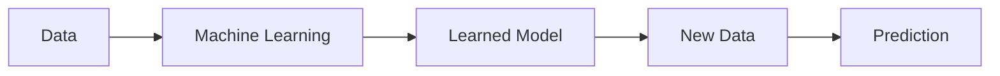
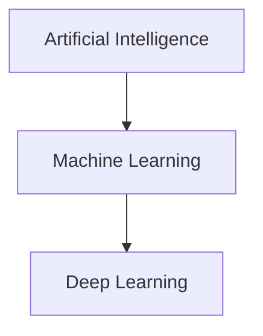

> [!abstract] Definition  
> **Machine Learning (ML)** is a way of building AI systems that learn patterns from data instead of being given every rule explicitly.

In traditional programming, a programmer writes rules and the computer follows those rules. In machine learning, we give the computer **data and examples**, and a learning algorithm finds useful patterns in that data.



For example, instead of writing thousands of rules to identify spam emails, we can give a machine-learning system many examples of **spam** and **normal emails**. The system learns patterns from those examples and uses what it learned to make predictions about new emails.

The important idea is:

> **Traditional programming: humans write the rules.**  
> **Machine learning: the system learns patterns from data.**

## A Simple Example

Suppose we want to predict whether a house will be expensive.

We could give the system examples containing information such as:

```text
House 1 → 800 sq ft → $100,000
House 2 → 1200 sq ft → $150,000
House 3 → 2000 sq ft → $250,000
```

The machine-learning algorithm looks at these examples and learns relationships between the information about the house and its price.

Later, we can give it a new house:

```text
1800 sq ft
```

and the trained model can produce a predicted price.

```text
Examples
   ↓
Machine Learning
   ↓
Learned Model
   ↓
New House
   ↓
Predicted Price
```

The model isn't simply remembering the examples. The goal is for it to **learn useful patterns that can also work on new data**.

## Machine Learning and AI

Machine Learning is a part of Artificial Intelligence.



So the relationship is:

**AI** is the broader field → **Machine Learning** is one approach used to build AI systems → **Deep Learning** is a type of machine learning.

We'll learn Deep Learning separately.

> [!important] Remember  
> **Machine Learning is about learning patterns from data so that a computer can make useful predictions or decisions on new data.**

The next concept is [[Deep Learning (DL)]], where we'll see how **neural networks** became a powerful way of doing machine learning.