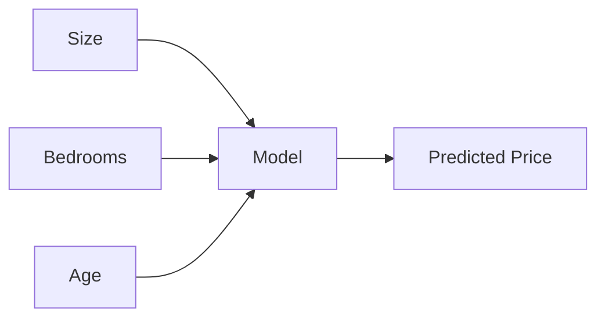

> [!abstract] Definition  
> **Features** are the pieces of information about something that a machine-learning model uses to make a prediction.

Think of a feature as an **input that can help the model understand or predict something**.

For example, if we want to predict the price of a house, useful features might be:

```text
House
├── Size
├── Number of bedrooms
├── Location
└── Age
```

These pieces of information can help the model estimate the house's price.

## Simple Example

Suppose our data looks like this:

|Size|Bedrooms|Age|Price|
|--:|--:|--:|--:|
|800|2|10|$100k|
|1200|3|5|$150k|
|1800|4|2|$220k|

Here:

- **Size** is a feature.
    
- **Bedrooms** is a feature.
    
- **Age** is a feature.
    
- **Price** is the value we are trying to predict.
    

So we can think of it as:



The model looks at the features together and learns how they relate to the prediction.

## Features in Different AI Problems

Features can look very different depending on the problem.

For a house-price model:

```text
Size
Bedrooms
Location
Age
```

For a spam-email model:

```text
Word frequency
Email length
Sender information
Number of links
```

For an image model, the situation is different. An image contains **pixels**, and a deep-learning model can learn useful visual features from those pixels.

```text
Image
 ↓
Pixels
 ↓
Learned visual features
 ↓
Prediction
```

This is one reason deep learning is powerful: the model can learn useful features automatically instead of requiring humans to manually define all of them.

> [!important] Remember  
> **A feature is an input or piece of information that a machine-learning model uses to make a prediction.**

