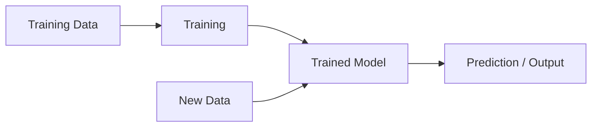

> [!abstract] Definition  
> **Inference** is the process of using a **trained model** to produce an output for new data.

Training and inference are two different stages.

During **training**, the model learns patterns.

During **inference**, the model uses those learned patterns.



## Simple Example

Suppose we trained a house-price model using thousands of houses.

Now we have a new house:

```text
Size = 1500 sq ft
Bedrooms = 3
Location = Dhaka
```

We give this information to the trained model.

```text
New House
   ↓
Trained Model
   ↓
Predicted Price
```

The model might produce:

```text
Predicted price = $180,000
```

That process of producing the prediction is **inference**.

## Training vs Inference

The easiest way to remember the difference is:

|Training|Inference|
|---|---|
|Model learns|Model is used|
|Uses training data|Uses new data|
|Changes the model|Normally does not change the model|
|Happens during model development|Happens when making predictions|

For example, when a company trains a model, training might take hours or days. Once the model is trained, users can send requests to it and receive predictions through inference.

```text
TRAINING

Data → Model → Learning → Trained Model


INFERENCE

New Data → Trained Model → Prediction
```

Inference is especially important in **AI Engineering** because a production AI application needs to run models efficiently whenever users send requests.

We will learn about things like **model serving, inference servers, latency, and optimization** much later.

> [!important] Remember  
> **Training = the model learns.**
> 
> **Inference = the trained model produces an output.**

