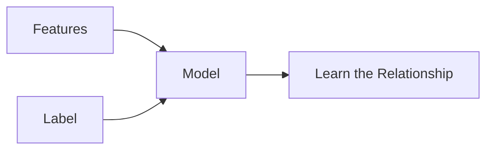

> [!abstract] Definition  
> **A label is the correct answer associated with a training example.**

Labels are mainly used in **supervised learning**, where we teach a model using examples that already have known answers.

For example, if we want to build a model that predicts house prices, the **price** can be the label.

|Size|Bedrooms|Label|
|--:|--:|--:|
|800 sq ft|2|$100k|
|1200 sq ft|3|$150k|
|1800 sq ft|4|$220k|

Here, **Size** and **Bedrooms** are features, while **Price** is the label.



During training, the model looks at the features and compares its prediction with the known label. This allows it to gradually improve.

For example:

```text
Features:
Size = 1200 sq ft
Bedrooms = 3

        ↓

Model

        ↓

Prediction = $140k

        ↓
Compare with label

Actual label = $150k
```

The difference between the prediction and the label helps the model learn how to make better predictions.

## Labels Can Be Different Things

A label does not always have to be a number.

For example, an email classification system might use:

```text
Email → Spam
Email → Not Spam
```

Here, **Spam** and **Not Spam** are labels.

An image classification system might use:

```text
Image → Cat
Image → Dog
Image → Bird
```

The labels represent the answers the model is learning to predict.

> [!important] Remember  
> **Features are the information given to the model. A label is the known answer the model is trying to learn to predict.**

A simple way to remember the difference:

```text
Features → What the model sees
Label    → What the model should predict
```

