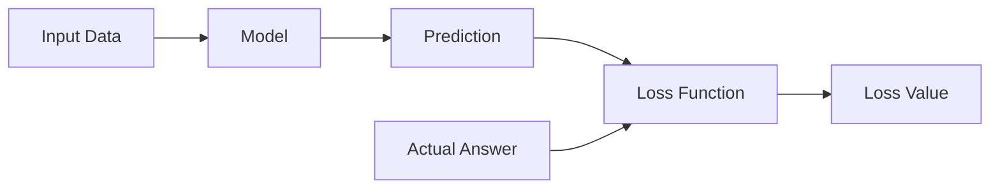

> [!abstract] Definition  
> A **loss function** measures how wrong a model's prediction is compared with the correct answer.

During training, the model makes predictions. We need a way to tell the model **how good or bad those predictions are**.

The loss function provides that measurement.

## Simple Example

Suppose we are predicting house prices.

The actual price is:

```text
$200,000
```

But the model predicts:

```text
$180,000
```

The prediction is wrong by some amount. A loss function converts that error into a **loss value**.



A **smaller loss generally means a better prediction**.

## Why Does the Model Need Loss?

The model needs some way to know whether it is improving.

A simplified training process looks like this:

```text
Input
  ↓
Model
  ↓
Prediction
  ↓
Loss Function
  ↓
How wrong was the prediction?
  ↓
Adjust Model
  ↓
Try Again
```

For example:

```text
Actual price:     $200,000
Prediction:       $150,000
Loss:             High

        ↓

Model adjusts

        ↓

Prediction:       $190,000
Loss:             Lower

        ↓

Model adjusts again

        ↓

Prediction:       $198,000
Loss:             Even lower
```

The model is trying to find parameters that produce **lower loss**.

## Loss Is Not Always Just "Distance"

Different machine-learning problems need different ways of measuring error.

For example, predicting a number such as a house price is different from classifying an email as spam or not spam.

So different problems can use different loss functions.

You don't need to learn the mathematical formulas yet. The important thing for now is understanding the role of a loss function.

Later, when we study neural networks, we'll see how the loss is used with **backpropagation** and **optimizers** to improve the model.

> [!important] Remember  
> **A loss function tells us how wrong a model's prediction is. During training, the model tries to reduce this loss.**

A useful mental model:

```text
Prediction
    +
Actual Answer
    ↓
Loss Function
    ↓
Loss
    ↓
How wrong is the model?
```

Next: [[Optimizers]]