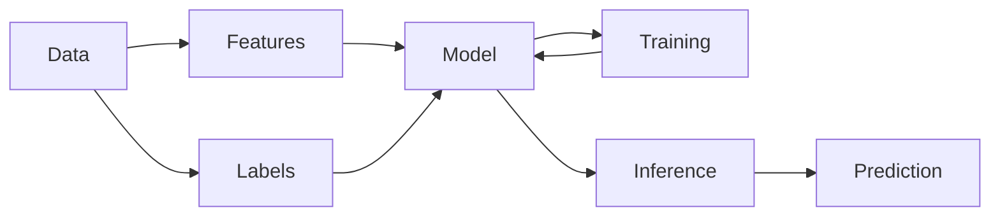

> [!abstract] Purpose  
> This phase introduces the basic ideas behind **Machine Learning**. The goal is to understand how a machine-learning system learns from data and uses what it learned to make predictions.

---

## Learning Path

### 01. [[Data]]

The information given to a machine-learning system so it can learn patterns.

### 02. [[Features]]

The pieces of information about something that a model can use to make a prediction.

### 03. [[Labels]]

The correct answers provided during training for supervised learning.

### 04. [[Models]]

The mathematical system that learns patterns from data and uses those patterns to produce predictions.

### 05. [[Training]]

The process of teaching a model by giving it data and adjusting it so that its predictions become better.

### 06. [[Inference]]

The process of using a trained model to make a prediction or produce an output for new data.

### 07. [[Training Data]]

The data used to teach a model.

### 08. [[Validation Data]]

Data used during development to check how well a model is performing and help make decisions about the model.

### 09. [[Test Data]]

Data kept separate from training and development to evaluate the model's final performance.

### 10. [[Loss Functions]]

A way of measuring how far a model's prediction is from the expected answer.

### 11. [[Optimizers]]

Algorithms that help adjust a model's parameters so that its predictions improve during training.

### 12. [[Overfitting]]

A situation where a model learns the training data too closely and performs poorly on new data.

### 13. [[Underfitting]]

A situation where a model has not learned enough from the training data and performs poorly even on the training examples.

---

## Learning Flow

The concepts in this phase are connected:

The basic idea is:

**Data → Model → Training → Learned Model → Inference → Prediction**

The other concepts in this phase help us understand what happens during this process and how we know whether the model is learning well.

> [!tip] Learning Goal  
> By the end of this phase, you should be able to explain the basic machine-learning process without needing to know the mathematics behind it yet.