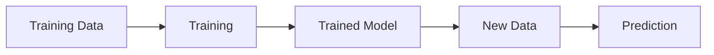

> [!abstract] Definition  
> A **machine-learning model** is a system that learns patterns from data and uses those patterns to produce predictions or outputs.

You can think of a model as the part of a machine-learning system that **learns how inputs are related to outputs**.

For example, if we want to predict house prices:

```text
Features
(Size, Bedrooms, Location)
        ↓
      Model
        ↓
Predicted Price
```

The model learns from many examples during **training**.

## Training a Model

Suppose we give the model many examples:

```text
House Data
    ↓
┌─────────────────────────┐
│ Size | Bedrooms | Price │
│ 800  | 2        | 100k  │
│ 1200 | 3        | 150k  │
│ 1800 | 4        | 220k  │
└─────────────────────────┘
    ↓
   Model
    ↓
Learns patterns
```

After training, the model can receive a new house that it has never seen before and make a prediction.

```text
New House
    ↓
Features
    ↓
Trained Model
    ↓
Predicted Price
```

## What Does the Model Actually Learn?

The model does not simply store a list of answers. It learns **patterns or relationships** in the training data.

For example, it might learn that, generally, larger houses tend to have higher prices.

The exact way a model represents these patterns depends on the type of machine-learning model being used.

Later, when we study neural networks, we'll see that these learned patterns are represented using things such as **parameters, weights, and biases**.

You don't need to understand those yet.

> [!important] Remember  
> **A model is the part of a machine-learning system that learns patterns from data and uses those patterns to make predictions or produce outputs.**

The basic process is:



One important distinction for later:

> **Training** is when the model learns.  
> **Inference** is when the trained model is used to produce an output.

We'll focus on training next.

