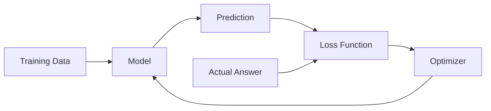
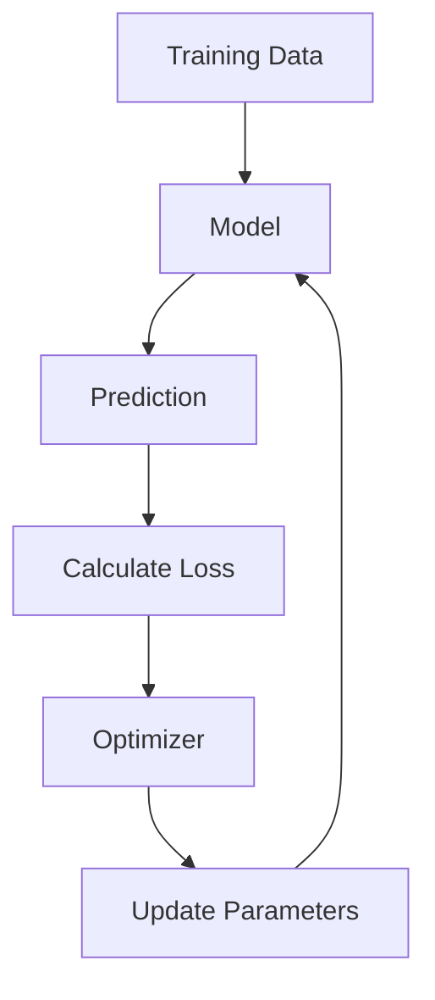

> [!abstract] Definition  
> An **optimizer** is the part of the training process that helps a model adjust its internal parameters so that its predictions become better.

The **loss function** tells us how wrong the model is. The **optimizer** helps the model decide how to change itself to reduce that error.

A simple way to remember it:

> **Loss tells us how bad the prediction is. The optimizer helps the model improve.**

## How They Work Together

Suppose a model makes a prediction:

```text
Actual answer → 100
Model prediction → 70
```

The loss function measures the error.

```text
Prediction
    ↓
Loss Function
    ↓
Loss = High
```

The optimizer then uses information from the loss to adjust the model's parameters.



This process repeats many times during training.

## A Simple Mental Model

Imagine you are trying to walk down a mountain while it is foggy.

You cannot see the entire mountain, but you can determine which direction goes downward from where you are standing.

The **loss** tells you how high you are.

The **optimizer** helps decide which direction to move to get lower.

```text
High Loss
   ↓
Adjust Parameters
   ↓
Lower Loss
   ↓
Adjust Parameters
   ↓
Lower Loss
   ↓
...
```

The model is not literally "thinking" about which direction to move. The optimizer uses mathematical information about the loss to update the model's parameters.

## Optimizer and Parameters

A model contains internal values called **parameters**.

During training:

```text
Parameters
    ↓
Model
    ↓
Prediction
    ↓
Loss
    ↓
Optimizer
    ↓
Updated Parameters
```

These parameter updates are what allow the model to learn.

We will study parameters, gradients, and gradient descent in much more detail when we reach **Neural Networks**.

## Common Optimizers

You may eventually encounter names such as:

- **Gradient Descent**
    
- **SGD (Stochastic Gradient Descent)**
    
- **Adam**
    
- **AdamW**
    

You don't need to memorize these yet. For now, just understand their purpose.

> [!important] Remember  
> **The loss function measures the model's error, while the optimizer updates the model's parameters to reduce that error.**

The basic training loop is:



This loop is one of the most important ideas in machine learning and deep learning.

Next: [[Overfitting]]