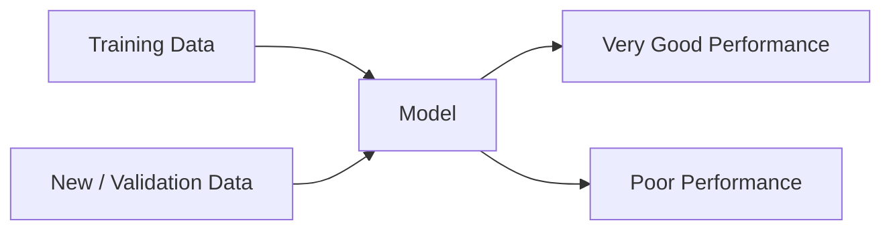

> [!abstract] Definition  
> **Overfitting** happens when a model learns the training data too closely and then performs poorly on new, unseen data.

A model should learn **general patterns**, not simply memorize the training examples.

## Simple Example

Imagine a student preparing for an exam.

If the student memorizes the exact answers to practice questions but doesn't understand the underlying concepts, they may perform very well on those practice questions but poorly on new questions.

A model can behave in a similar way.

```text
Training Data
     ↓
Model learns patterns
     ↓
Too much memorization
     ↓
Excellent training performance
     ↓
Poor performance on new data
```

## Training vs New Data

Suppose a model has these results:

```text
Training accuracy:   99%
Validation accuracy: 78%
```

The model performs extremely well on the data it learned from, but much worse on data it hasn't seen.

That is a sign of possible **overfitting**.



## Why Does Overfitting Happen?

There are several possible reasons.

For example, the model may be:

- Too complex for the amount of data available
- Trained for too long
- Learning noise or unusual details in the training data
- Working with a dataset that is too small

The important idea is that the model has learned details that **do not generalize well**.

## Generalization

The opposite of memorization is **generalization**.

A good model should learn patterns that work beyond the examples it saw during training.

```text
Training Examples
       ↓
   Learn Patterns
       ↓
     Model
       ↓
   New Examples
       ↓
Useful Predictions
```

This ability to perform well on new data is called **generalization**.

Overfitting means the model has poor generalization.

> [!important] Remember  
> **Overfitting = the model learns the training data too closely and performs poorly on new data.**

A simple mental model:

```text
Too little learning → Underfitting
Good learning       → Good generalization
Too much memorizing → Overfitting
```

We'll look at **Underfitting** next.

Next: [[Underfitting]]