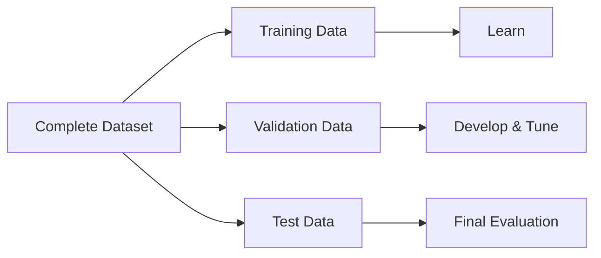

> [!abstract] Definition  
> **Test data** is a separate set of examples used to measure how well a trained model performs on data it has not seen during training or development.

The key idea is that **test data should be kept separate until the final evaluation**.

## The Three Dataset Split

A machine-learning dataset is often divided into three parts:



Each part has a different purpose.

**Training data** is used to teach the model.

**Validation data** is used while developing the model, for example to compare different approaches or settings.

**Test data** is used at the end to get a final measurement of how well the model performs.

## Simple Example

Suppose we have **10,000 examples**:

```text
10,000 Examples
│
├── 8,000 → Training
├── 1,000 → Validation
└── 1,000 → Test
```

The model learns from the 8,000 training examples.

We use the 1,000 validation examples while developing the model.

After we are satisfied with the model, we use the 1,000 test examples for the final evaluation.

## Why Keep Test Data Separate?

Imagine you are preparing for an exam.

If you practice using the actual exam questions, you might memorize the answers. Getting a high score would not necessarily mean you truly understand the subject.

The same idea applies to machine learning.

If we repeatedly use the test data while developing the model, we can accidentally make decisions based on that data. The final test result may then give us an overly optimistic view of the model.

So we try to keep the test data **unseen until the final evaluation**.

```text
Training Data
      ↓
   Train Model
      ↓
Validation Data
      ↓
Improve / Choose Model
      ↓
   Final Model
      ↓
  Test Data
      ↓
Final Evaluation
```

> [!important] Remember  
> **Training data teaches the model, validation data helps us develop it, and test data gives us the final evaluation.**

Next: [[Loss Functions]]