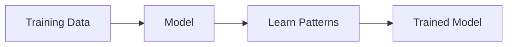

# Training Data

> [!abstract] Definition  
> **Training data** is the data used to teach a machine-learning model.

During training, the model looks at many examples and learns patterns from them.

For example, if we want to build a model that recognizes cats, our training data might contain many images:

```text
Image 1 → Cat
Image 2 → Cat
Image 3 → Dog
Image 4 → Cat
Image 5 → Dog
...
```

The model uses these examples to learn patterns that help it distinguish between cats and dogs.



## Features and Labels in Training Data

In supervised learning, a training example usually contains **features** and a **label**.

For example:

|Size|Bedrooms|Price|
|--:|--:|--:|
|800 sq ft|2|$100k|
|1200 sq ft|3|$150k|
|1800 sq ft|4|$220k|

Here:

- **Size** and **Bedrooms** are features.
    
- **Price** is the label.
    

The model uses these examples to learn the relationship between the features and the label.

## Why Training Data Matters

A model can only learn from the information available in its training data.

If the training data is poor, incomplete, or contains incorrect information, the model may learn poor patterns.

For example, if a model is trained using only pictures of cats taken in one specific environment, it may struggle when shown cats in very different environments.

This is why **the quality and variety of training data are important**.

> [!important] Remember  
> **Training data is the collection of examples a model learns from during training.**

A simple mental model:

```text
Training Data
      ↓
    Model
      ↓
Learns Patterns
      ↓
Trained Model
```

Next: [[Validation Data]]