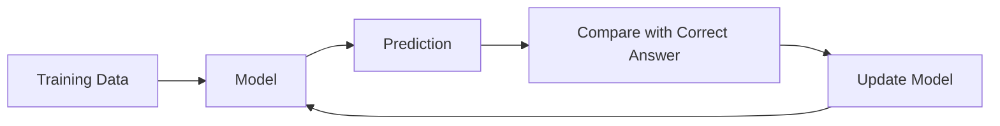

> [!abstract] Definition  
> **Training** is the process of teaching a machine-learning model to learn useful patterns from data.

During training, the model makes predictions, checks how good those predictions are, and adjusts itself to become better.

A simplified training process looks like this:



This process happens repeatedly with many examples.

## Simple Example

Suppose we are training a model to predict house prices.

The model sees:

```text
Size = 1200 sq ft
Bedrooms = 3
Actual Price = $150,000
```

At first, the model might predict:

```text
Prediction = $110,000
```

The prediction is not very good, so the model adjusts itself.

After seeing many examples and making many adjustments, it might eventually produce:

```text
Prediction = $148,000
```

The model is learning because its internal values are being adjusted based on its mistakes.

## Training Is Repeated

Training doesn't usually happen just once.

The model goes through many examples repeatedly:

```text
Data
 ↓
Prediction
 ↓
Measure Error
 ↓
Adjust Model
 ↓
Prediction
 ↓
Measure Error
 ↓
Adjust Model
 ↓
...
```

Over time, the model should become better at making predictions on the training data.

Later, we'll learn exactly **how the model measures its mistakes** and **how it changes itself**. Those concepts are called [[Loss Functions]] and [[Optimizers]].

> [!important] Remember  
> **Training is the process of repeatedly showing data to a model, measuring its mistakes, and adjusting the model so that it can learn useful patterns.**

For now, think of training like **practice**: the model practices on examples and gradually improves.

