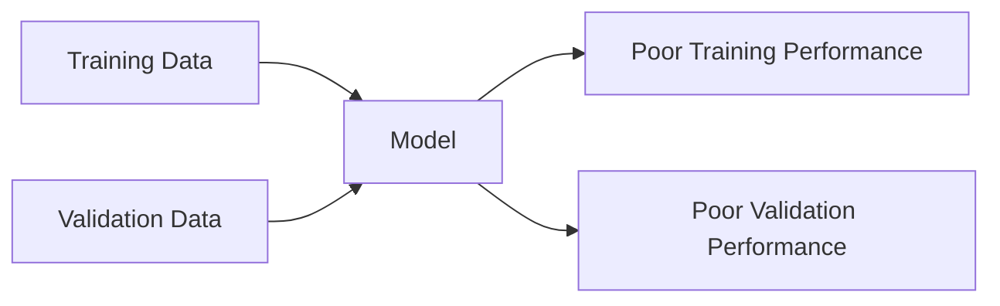
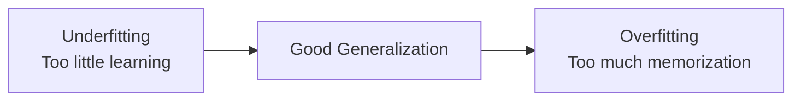

> [!abstract] Definition  
> **Underfitting** happens when a model has not learned enough from the training data, so it performs poorly even on the data it was trained on.

The model is too simple, not trained enough, or otherwise unable to capture the important patterns in the data.

## Simple Example

Imagine a student who barely studies for an exam.

They don't memorize the practice answers, but they also don't understand the underlying concepts. As a result, they perform poorly on both practice questions and new questions.

A model can behave similarly.

```text
Training Data
     ↓
Model does not learn enough
     ↓
Poor understanding of patterns
     ↓
Poor performance
```

## Training vs Validation

Suppose we get results like:

```text
Training accuracy:   65%
Validation accuracy: 63%
```

Both results are poor.

This can be a sign that the model is **underfitting**.



Compare this with overfitting:

```text
                 Training     Validation
                 
Underfitting       Poor          Poor

Good Model         Good          Good

Overfitting        Excellent     Poor
```

## Why Does Underfitting Happen?

Underfitting can happen for several reasons.

For example:

- The model is too simple.
- The model has not been trained enough.
- The features do not contain enough useful information.
- The training process is not working well.
    

The result is that the model fails to learn the important patterns in the data.

## Underfitting vs Overfitting

These two concepts are important because they represent two different problems.



The goal is not simply to make the model perform extremely well on training data.

The goal is to learn patterns that allow the model to **perform well on new data**.

> [!important] Remember  
> **Underfitting = the model has not learned enough.**
> 
> **Overfitting = the model has learned the training data too closely.**
> 
> **Good generalization = the model has learned useful patterns that work on new data.**

This completes **Phase 2 — Machine Learning Fundamentals**.

The next phase, [[03 — Neural Networks]], will explain the main building blocks behind modern deep learning: **neurons, layers, weights, biases, activations, forward passes, backpropagation, and gradients**.