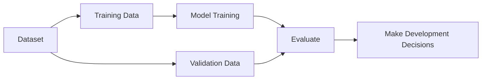

> [!abstract] Definition  
> **Validation data** is a separate portion of data used during model development to check how well the model is performing and help make decisions about the model.

The important idea is that **validation data is not used to directly train the model**.

Instead, we use it to answer questions like:

- Is the model improving?
    
- Is the model starting to overfit?
    
- Which model settings work better?
    
- Should we train for more time?
    

## Training vs Validation

Suppose we have 10,000 examples.

We might divide them like this:

```text
10,000 Examples
│
├── 8,000 → Training Data
│
└── 2,000 → Validation Data
```

The model learns from the **8,000 training examples**.

Afterward, we check the model using the **2,000 validation examples**.



## Why Do We Need Validation Data?

Imagine you are training a model and you keep changing it until it performs extremely well on the training data.

The model might eventually become too specialized to those examples.

We need another set of examples to check whether the model is still performing well on data it **didn't train on**.

That's where validation data helps.

For example:

```text
Training performance → 98%
Validation performance → 82%
```

This difference might be a warning that the model is **overfitting**.

We'll study overfitting later.

## Training, Validation, and Test Data

You will often see three different datasets:

```text
                    Dataset
                       │
          ┌────────────┼────────────┐
          ↓            ↓            ↓
      Training     Validation      Test
       Data          Data          Data
          │            │             │
          ↓            ↓             ↓
       Learn        Develop       Final
       Model        Model        Evaluation
```

For now, remember their basic roles:

**Training data** → teaches the model.

**Validation data** → helps us develop and improve the model.

**Test data** → gives us a final evaluation.

> [!important] Remember  
> **Validation data is used to evaluate and improve our model during development, without using those examples to directly train the model.**

