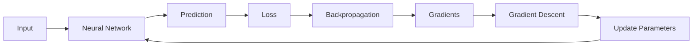

> [!abstract] Purpose  
> This phase introduces **neural networks**, the main building blocks behind modern deep learning. The goal is to understand how a neural network is structured and how it learns from data.

---

## Learning Path

### 01. [[Neural Networks]]

The overall idea of a neural network and why neural networks are useful for learning patterns.

### 02. [[Neurons]]

The basic computational units inside a neural network.

### 03. [[Weights and Biases]]

The internal values a neural network learns during training.

### 04. [[Layers]]

How neurons are organized into input, hidden, and output layers.

### 05. [[Activation Functions]]

Functions that help neural networks learn complex, non-linear patterns.

### 06. [[Parameters]]

The learnable values inside a model, mainly weights and biases.

### 07. [[Forward Pass]]

The process of sending input through a neural network to produce an output.

### 08. [[Loss]]

The measurement of how far the network's prediction is from the expected answer.

### 09. [[Backpropagation]]

The process used to determine how the model's parameters contributed to the error.

### 10. [[Gradients]]

Values that tell us how changing a parameter would affect the loss.

### 11. [[Gradient Descent]]

A method for gradually changing parameters to reduce the loss.

### 12. [[Epochs]]

How many times the training process goes through the training dataset.

### 13. [[Batches]]

Smaller groups of training examples processed together during training.

### 14. [[Learning Rate]]

A value that controls how large the parameter updates are during training.

---

## Learning Flow

The main ideas in this phase connect together like this:

The basic training idea is:

**Input → Prediction → Loss → Gradients → Parameter Updates → Better Prediction**

We will build this understanding slowly, starting with the simplest concept: **what a neural network is**.

> [!tip] Learning Goal  
> By the end of this phase, you should be able to look at a simple neural network and understand what its **neurons, layers, weights, biases, parameters, inputs, and outputs** represent, and have a basic understanding of how the network learns.