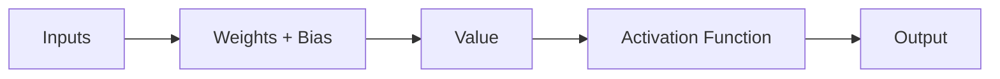
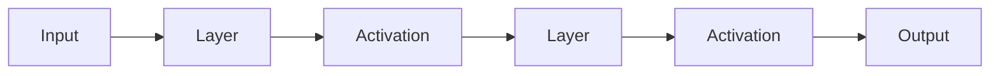

# Activation Functions

> [!abstract] Definition  
> An **activation function** is a function used inside a neural network to transform a neuron's output and help the network learn complex patterns.

Without activation functions, stacking many neural-network layers would still behave like a much simpler mathematical operation. Activation functions introduce **non-linearity**, which allows neural networks to learn more complicated relationships.

## Where It Fits

A simplified neuron works like this:



The neuron first combines its inputs using weights and a bias. The result then passes through an activation function.

## Why Do We Need It?

Imagine a model trying to learn a complicated relationship.

Without activation functions, the layers would mostly perform simple linear transformations.

With activation functions, the network can build more complex patterns:

```text
Input
 ↓
Simple transformation
 ↓
Activation
 ↓
Another transformation
 ↓
Activation
 ↓
Complex pattern
 ↓
Output
```

This is especially important for problems such as image recognition, speech recognition, and language processing.

## Common Activation Functions

You will encounter several activation functions in deep learning.

### ReLU

**ReLU (Rectified Linear Unit)** is one of the most common activation functions in neural networks.

Its basic behavior is simple:

```text
Negative input → 0
Positive input → stays positive
```

For example:

```text
-3 → 0
-1 → 0
 0 → 0
 2 → 2
 5 → 5
```

The exact mathematical definition is:

```text
ReLU(x) = max(0, x)
```

You don't need to memorize the formula yet. Just remember that ReLU removes negative values and keeps positive values.

### Other Functions

Other activation functions include:

- **Sigmoid**
    
- **Tanh**
    
- **Softmax**
    
- **GELU**
    

Different functions are useful in different situations.

For example, **Softmax** is commonly used in classification models when we want outputs that represent probabilities across multiple classes.

## Activation Functions and Deep Learning

Activation functions are applied throughout a neural network.



This repeated transformation allows the network to learn increasingly complex relationships.

> [!important] Remember  
> **Activation functions transform the output of neurons and introduce non-linearity, allowing neural networks to learn complex patterns.**

For now, remember three things:

1. A neuron produces a value.
    
2. The activation function transforms that value.
    
3. Activation functions help neural networks learn complex relationships.
    

Next: [[Parameters]]