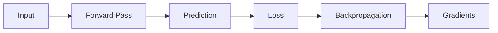
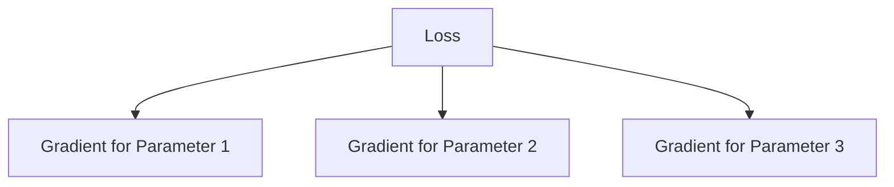
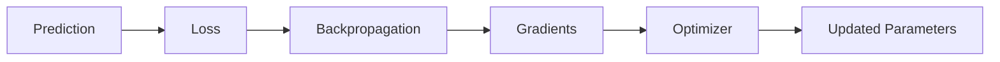

 # Backpropagation

> [!abstract] Definition  
> **Backpropagation** is the process used to determine how much each parameter in a neural network contributed to the error.

A neural network first makes a prediction. We calculate the loss, and then backpropagation works **backward through the network** to calculate the information needed to improve the model.

## The Basic Idea

The process looks like this:



The forward pass moves **from input to output**.

Backpropagation moves the learning information **from the loss backward through the network**.

```text
Forward:

Input → Layer → Layer → Output → Loss


Backward:

Loss → Layer → Layer → Gradients
```

## Why Is Backpropagation Needed?

Imagine a neural network has thousands of parameters.

The model makes a bad prediction, but we need to know:

> Which parameters should change, and by how much?

Backpropagation helps answer this question.

It calculates a **gradient** for each parameter. The gradient tells us how changing that parameter would affect the loss.



We will study gradients in the next topic.

## A Simple Example

Imagine a very small network:

```text
Input
  ↓
Neuron A
  ↓
Neuron B
  ↓
Prediction
  ↓
Loss
```

The model produces a prediction that is wrong.

Backpropagation starts from the loss:

```text
Loss
 ↓
How did Neuron B affect the loss?
 ↓
How did Neuron A affect the loss?
 ↓
How did their parameters affect the loss?
```

It works backward through the network to calculate these relationships.

This is why it is called **backpropagation**: information about the error is propagated backward through the network.

## Backpropagation Does Not Update the Model

This distinction is important.

Backpropagation **calculates gradients**.

An optimizer then uses those gradients to **update the parameters**.



So the roles are:

**Loss → tells us how wrong the model is.**

**Backpropagation → calculates how parameters affect that error.**

**Optimizer → uses that information to update the parameters.**

> [!important] Remember  
> **Backpropagation works backward from the loss through the neural network to calculate gradients for the model's parameters.**

You don't need to understand the calculus behind it yet. The most important mental model is:

```text
Forward Pass
    ↓
Prediction
    ↓
Loss
    ↓
Backpropagation
    ↓
Gradients
    ↓
Parameter Updates
```

Next: [[Gradients]]
