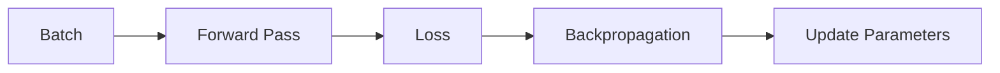
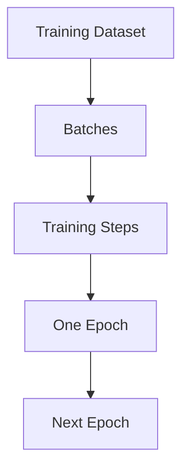

# Batches

> [!abstract] Definition  
> A **batch** is a smaller group of training examples that a model processes together during training.

Instead of giving the entire training dataset to the model at once, we usually divide it into smaller batches.

## Simple Example

Suppose our training dataset contains **10,000 examples**.

Instead of processing all 10,000 at once, we could use a batch size of **100**.

```text
Training Dataset
10,000 examples
       ↓
┌─────────────────────┐
│ Batch 1 → 100       │
│ Batch 2 → 100       │
│ Batch 3 → 100       │
│ ...                 │
│ Batch 100 → 100     │
└─────────────────────┘
```

The model processes one batch at a time.

## Batch and Parameter Updates

For each batch, the model generally performs a training step:



After processing the next batch, the process happens again.

```text
Batch 1 → Update
Batch 2 → Update
Batch 3 → Update
...
Batch 100 → Update
```

After all batches have been processed, **one epoch is complete**.

```text
100 Batches
     ↓
1 Epoch
```

## Batch Size

The number of examples inside a batch is called the **batch size**.

For example:

```text
Batch size = 32
→ 32 examples processed together

Batch size = 64
→ 64 examples processed together

Batch size = 256
→ 256 examples processed together
```

The appropriate batch size depends on the model, dataset, and available hardware.

You will encounter batch sizes such as **32, 64, 128, or 256**, but there is no single best value for every situation.

## Why Use Batches?

Processing the entire dataset at once can require a large amount of memory.

Batches allow us to process the data in manageable pieces.

```text
Large Dataset
      ↓
Smaller Batches
      ↓
Process One Batch
      ↓
Update Model
      ↓
Process Next Batch
```

Batches also work well with GPUs because GPUs are designed to perform many similar operations in parallel.

We will explore this much more when we study **AI hardware and GPUs**.

## Batch vs Epoch

These two terms are easy to confuse.

|Concept|Meaning|
|---|---|
|Batch|A group of training examples processed together|
|Epoch|One complete pass through the entire training dataset|

For example:

```text
Dataset = 10,000 examples
Batch size = 100

10,000 ÷ 100 = 100 batches

100 batches = 1 epoch
```

If we train for 5 epochs:

```text
100 batches × 5 epochs
= 500 batch processing steps
```

> [!important] Remember  
> **A batch is a small group of training examples processed together. An epoch is one complete pass through the entire training dataset.**

The basic relationship is:



Next: [[Learning Rate]]