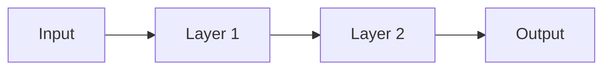
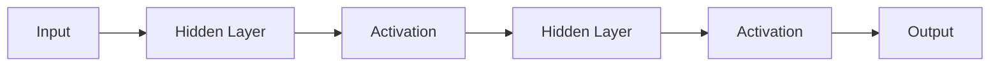
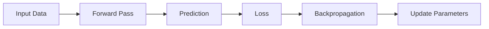

# Forward Pass

> [!abstract] Definition  
> A **forward pass** is the process of sending input data through a neural network from the input layer to the output layer to produce a prediction.

It is called a **forward** pass because information moves forward through the network.



## Simple Example

Suppose we want a neural network to predict whether a student will pass an exam.

The inputs might be:

```text
Hours studied = 5
Attendance = 90%
Previous score = 75
```

These values enter the neural network.

```text
Input
  ↓
Neurons
  ↓
Weights + Biases
  ↓
Activation Functions
  ↓
More Layers
  ↓
Output
```

The network eventually produces something like:

```text
Prediction = 0.85
```

We might interpret this as an **85% probability of passing**, depending on how the model is designed.

## What Happens Inside?

Each layer receives values from the previous layer, performs calculations, and sends new values to the next layer.

For a simplified network:



The network uses its current **weights and biases** during this process.

Importantly, the forward pass itself does **not** update the model's parameters.

It simply uses the current parameters to calculate an output.

## Forward Pass During Training

A forward pass is part of the larger training process:



The forward pass produces the prediction.

The loss tells us how wrong that prediction was.

Later, **backpropagation** calculates how the parameters contributed to that error, and the optimizer updates them.

## Forward Pass During Inference

A forward pass also happens when we use a trained model to make a prediction.

```text
New Data
   ↓
Forward Pass
   ↓
Trained Model
   ↓
Output
```

So the forward pass is not only a training concept. It is a fundamental operation whenever a neural network processes input.

> [!important] Remember  
> **A forward pass is the process of moving input through a neural network to produce an output.**

The basic idea is:

**Input → Layers → Prediction**

Next: [[Loss]]