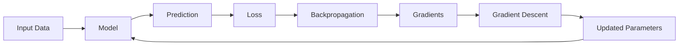

# Gradient Descent

> [!abstract] Definition  
> **Gradient descent** is an optimization method used to adjust a model's parameters so that the **loss becomes smaller**.

We already learned that **gradients** tell us which direction the loss changes. Gradient descent uses that information to decide how to update the model's parameters.

## The Basic Idea

The training process looks like this:



The model repeatedly:

1. Makes a prediction.
    
2. Calculates the loss.
    
3. Calculates gradients.
    
4. Updates its parameters.
    
5. Tries again.
    

## The Mountain Analogy

Imagine standing somewhere on a mountain and trying to reach the lowest point.

You cannot see the entire mountain, but you can determine the **slope** around you.

The gradient tells you about that slope.

Gradient descent says:

> **Move in the opposite direction of the gradient to try to reach a lower point.**

```text
        High Loss
           ●
          /
         /
        ●
       /
      ●
     /
    ●
   /
  ●────────────
       Low Loss
```

Each step tries to move toward a lower-loss area.

## Parameter Updates

Suppose a parameter currently has this value:

```text
Parameter = 5.0
```

The gradient tells us which direction would increase the loss.

If the gradient is positive, gradient descent generally moves the parameter downward.

If the gradient is negative, it generally moves the parameter upward.

The size of that movement depends on the **learning rate**.

```text
Gradient
   +
Learning Rate
   ↓
Parameter Update
```

The simplified idea is:

```text
New Parameter
    =
Old Parameter
    -
Update
```

You don't need to memorize the mathematical formula yet.

## Learning Rate

The **learning rate** controls how large each update is.

Imagine walking down the mountain.

A very large step might look like:

```text
●
   ↘
      ●
          ↘
             ●
```

You may move too far and miss the lowest point.

Very small steps might look like:

```text
● → ● → ● → ● → ●
```

You move safely, but training can take a very long time.

This is why choosing an appropriate learning rate is important.

We'll study it separately in [[Learning Rate]].

## Gradient Descent in Neural Networks

A neural network can have millions or even billions of parameters.

Gradient descent provides a general idea for how those parameters can be gradually improved:

```text
Parameters
    ↓
Forward Pass
    ↓
Prediction
    ↓
Loss
    ↓
Backpropagation
    ↓
Gradients
    ↓
Gradient Descent
    ↓
Updated Parameters
    ↓
Repeat
```

This repeated process is the heart of neural-network training.

> [!important] Remember  
> **Gradient descent uses gradients to update model parameters in a direction that aims to reduce the loss.**

The key relationship to remember is:

```text
Loss
 ↓
Backpropagation
 ↓
Gradients
 ↓
Gradient Descent
 ↓
Updated Parameters
```

Next: [[Epochs]]