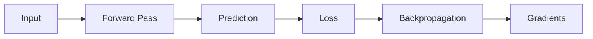
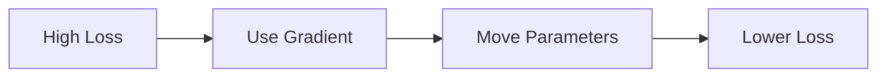
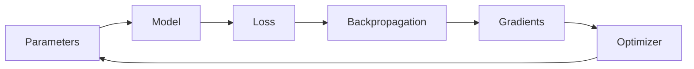

# Gradients

> [!abstract] Definition  
> A **gradient** tells us how a small change in a model parameter would affect the loss.

Gradients are the information that helps the model understand **which direction its parameters should move to reduce the loss**.

## Where Gradients Come From

During training, the process looks like this:



The **forward pass** produces a prediction.

The **loss** measures how wrong the prediction is.

**Backpropagation** then calculates the gradients.

## A Simple Example

Imagine a model has one parameter:

```text
Parameter = 5
```

Suppose the gradient tells us:

```text
Gradient = +2
```

This means that increasing this parameter would increase the loss, based on the current point.

To reduce the loss, we generally want to move the parameter in the **opposite direction of the gradient**.

```text
Positive gradient
       ↓
Move parameter downward
       ↓
Try to reduce loss
```

If the gradient were negative:

```text
Negative gradient
       ↓
Move parameter upward
       ↓
Try to reduce loss
```

This is the basic idea behind **gradient descent**.

## Visualizing the Idea

Imagine the loss as a landscape:

```text
        Loss
         ↑
         |
       /\ 
      /  \
     /    \        ← High loss
    /      \
   /        \
  /          \____
                    \___  ← Low loss
                         \
                          ↓
                       Better
```

The gradient gives information about the direction of the slope.

The training process tries to move the model toward areas with **lower loss**.



## Gradient vs Parameter

It is important not to confuse them.

A **parameter** is a value the model learns:

```text
Weight = 0.7
```

A **gradient** describes how changing that parameter affects the loss:

```text
Gradient = +0.4
```

The gradient is not the parameter itself. It is information used to decide how the parameter should change.

## Gradients and Optimizers

The optimizer uses gradients to update the parameters.



This creates the learning cycle:

```text
Prediction
    ↓
Loss
    ↓
Gradients
    ↓
Parameter Update
    ↓
Better Prediction
```

> [!important] Remember  
> **A gradient tells the training process how changing a parameter would affect the loss. The optimizer uses this information to update the parameters and reduce the loss.**

The next topic combines these ideas into one of the most important concepts in neural-network training: [[Gradient Descent]].