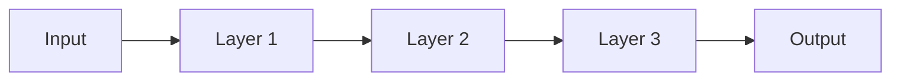

# Layers

> [!abstract] Definition  
> A **layer** is a group of neurons that work together inside a neural network. Layers organize the computation that transforms an input into an output.

A neural network usually contains an **input layer**, one or more **hidden layers**, and an **output layer**.


## Input Layer

The **input layer** receives the information given to the network.

For example, if we want to predict a house price, the inputs might be:

```text
Size
Bedrooms
Age
```

These values enter the network through the input layer.

```text
House Data
    ↓
Input Layer
```

## Hidden Layers

The layers between the input and output are called **hidden layers**.

They transform the information and allow the network to learn useful patterns.

```text
Input
  ↓
Hidden Layer
  ↓
Hidden Layer
  ↓
Hidden Layer
  ↓
Output
```

A network with many hidden layers is called a **deep neural network**.

The word _deep_ refers mainly to having many layers of computation.

## Output Layer

The **output layer** produces the final result of the network.

For example:

```text
Input:
House information

      ↓

Neural Network

      ↓

Output:
Predicted price = $200,000
```

For a classification problem, the output might instead represent a class:

```text
Image
 ↓
Neural Network
 ↓
Output
 ↓
Cat
```

## Layers Work Together

Each layer takes the output from the previous layer and transforms it.



A useful way to think about this is:

> **Each layer transforms information so that the next layer can work with a more useful representation.**

For example, in an image model, early layers may learn simple visual patterns, while deeper layers can combine those patterns into more complex structures.

You don't need to understand exactly how this happens yet.

## Why Layers Matter

A single neuron can perform a relatively simple calculation. A layer contains many neurons, and multiple layers allow a neural network to perform a sequence of transformations.

```text
Many neurons
      ↓
A layer
      ↓
Many layers
      ↓
Complex computation
      ↓
Prediction
```

This layered structure is one of the main reasons neural networks can learn complicated patterns.

> [!important] Remember  
> **A layer is a group of neurons that performs part of the computation in a neural network.**
> 
> **Input layer → receives data**
> 
> **Hidden layers → transform and learn representations**
> 
> **Output layer → produces the result**

Next: [[Activation Functions]]