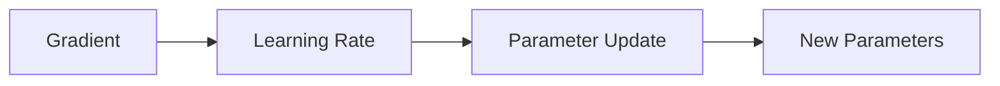
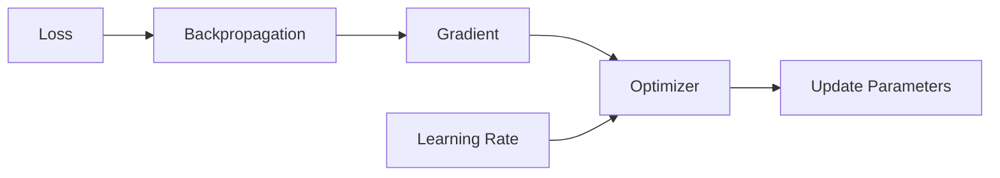

# Learning Rate

> [!abstract] Definition  
> The **learning rate** controls how much a model's parameters change during each training update.

It is one of the most important settings in neural-network training.

## The Basic Idea

We learned that **gradients** tell us which direction we should move to reduce the loss.

The learning rate controls **how big that movement should be**.



A simple way to think about it:

```text
Gradient
   ↓
Which direction?
   
Learning Rate
   ↓
How big a step?
```

## Large vs Small Learning Rate

Imagine you are walking down a mountain and trying to reach the lowest point.

With a **very large learning rate**, your steps may be too big.

```text
        ●
       ↘
          ●
             ↘
                ●
                   ↗
```

You might jump over the lowest point or even make training unstable.

With a **very small learning rate**, your steps may be tiny.

```text
● → ● → ● → ● → ● → ●
```

The model may eventually improve, but training can take a very long time.

A suitable learning rate allows the model to make useful progress without taking unnecessarily large steps.

## Learning Rate During Training

The simplified training process is:

```text
Input
  ↓
Forward Pass
  ↓
Prediction
  ↓
Loss
  ↓
Backpropagation
  ↓
Gradient
  ↓
Learning Rate
  ↓
Update Parameters
```

The learning rate is used when the optimizer updates the model's parameters.



## Example

Suppose a parameter needs to move downward.

With a relatively large learning rate:

```text
Current parameter
       ↓
Large update
       ↓
New parameter
```

With a small learning rate:

```text
Current parameter
       ↓
Small update
       ↓
New parameter
```

The exact update depends on the gradient and optimizer, but the learning rate controls the **scale of the update**.

## Why It Matters

If the learning rate is poorly chosen, training can have problems.

```text
Too Large
   ↓
Unstable training
or
Loss may fail to decrease


Good Learning Rate
   ↓
Steady improvement


Too Small
   ↓
Very slow training
```

This is why the learning rate is called a **hyperparameter**. The engineer chooses it; the model does not learn it in the same way it learns weights and biases.

> [!important] Remember  
> **The learning rate controls how much the model's parameters change during each update.**

The simplest mental model is:

**Gradient → direction**

**Learning rate → step size**

**Optimizer → performs the update**

---

## Phase 3 Summary

You have now covered the main foundations of neural-network training:

```text
Neural Network
      ↓
Neurons
      ↓
Weights + Biases
      ↓
Layers
      ↓
Activation Functions
      ↓
Parameters
      ↓
Forward Pass
      ↓
Loss
      ↓
Backpropagation
      ↓
Gradients
      ↓
Gradient Descent
      ↓
Epochs + Batches
      ↓
Learning Rate
```

These concepts form the foundation for understanding how a neural network **learns**.

Next phase: [[04 — Tensors]]