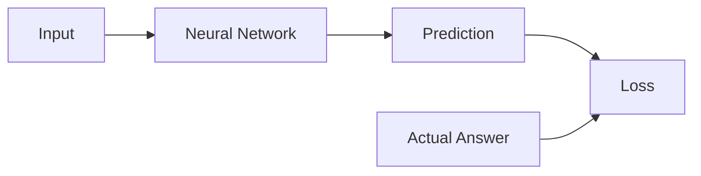
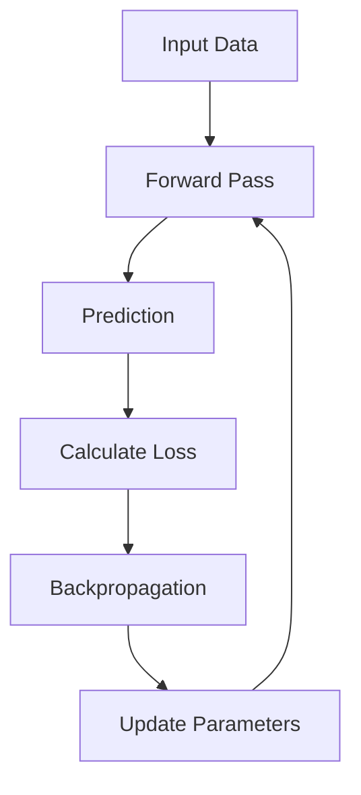

# Loss

> [!abstract] Definition  
> **Loss** is a number that tells us how wrong a neural network's prediction is compared with the correct answer.

We already introduced **loss functions** in Machine Learning Fundamentals. Here, we look at loss specifically as part of the neural-network training process.

## Loss in a Neural Network

During a forward pass, the network produces a prediction.

We then compare that prediction with the actual answer.



For example, suppose the correct answer is:

```text
Actual = 1
```

But the network predicts:

```text
Prediction = 0.3
```

The prediction is not very good, so the loss will be relatively high.

If the network instead predicts:

```text
Prediction = 0.95
```

the loss would generally be much smaller.

```text
Better prediction
       ↓
Lower loss
       ↓
Better model
```

## Loss Guides Learning

The important part is that loss is used to **guide the training process**.

A simplified training loop looks like this:



The model makes a prediction, calculates the loss, and then uses that information to determine how its parameters should change.

This process happens repeatedly.

## Loss Is Not the Same as Accuracy

Loss and accuracy are related, but they are not the same thing.

**Accuracy** tells us how many predictions were correct.

**Loss** gives us a numerical measure of how far the predictions are from the desired outputs.

For example, two models might both classify 90 out of 100 examples correctly, giving both an accuracy of 90%. However, their loss values can still be different because the models may have different confidence in their predictions.

You don't need to worry about the mathematics behind this yet. The important idea is that **loss provides a signal that helps the network learn**.

## Common Loss Functions

Different problems can use different loss functions.

Some common examples are:

- **Mean Squared Error (MSE)** — often used for regression.
    
- **Cross-Entropy Loss** — commonly used for classification.
    
- **Binary Cross-Entropy** — commonly used for binary classification.
    

The choice of loss function depends on what the model is trying to predict.

> [!important] Remember  
> **Loss measures how wrong the model's prediction is. During training, the neural network tries to reduce its loss by changing its parameters.**

The training cycle we have seen so far is:

```text
Input
  ↓
Forward Pass
  ↓
Prediction
  ↓
Loss
  ↓
Backpropagation
  ↓
Parameter Update
  ↓
Repeat
```

The next topic explains the important step that comes after calculating the loss: [[Backpropagation]].