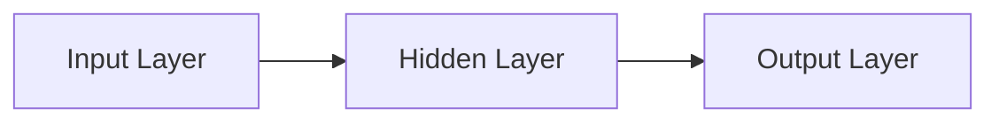
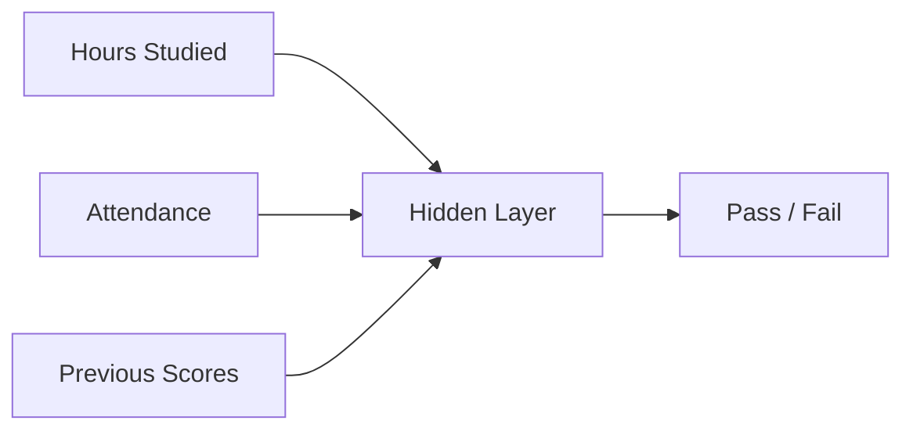

# Neural Networks

> [!abstract] Definition  
> A **neural network** is a machine-learning model made of connected computational units called **neurons**. It learns patterns by adjusting the connections between these neurons.

Neural networks are the foundation of **deep learning**. They are especially useful when the patterns in the data are complex, such as images, speech, and language.

## Basic Structure

A simple neural network can be thought of as three parts:



The **input layer** receives the input data.

The **hidden layers** process the information and learn useful patterns.

The **output layer** produces the final result.

A network with many hidden layers is generally called a **deep neural network**.

## A Simple Example

Suppose we want to predict whether a student will pass an exam.

We might provide:

```text
Hours studied
Attendance
Previous scores
```

These values enter the neural network.



The network processes these inputs and produces an output such as:

```text
Pass
```

During training, the network compares its prediction with the correct answer and adjusts its internal values so that future predictions become better.

## What Makes a Neural Network Learn?

The connections inside a neural network have values called **weights**. Neurons can also have **biases**.

These values are adjusted during training.

```text
Input
  ↓
Weights + Biases
  ↓
Neural Network
  ↓
Output
```

You don't need to understand the mathematics yet. The important idea is:

> **The network learns by changing its internal parameters.**

These parameters allow the network to represent patterns in the training data.

## Why Are There Multiple Layers?

A single layer may only be able to learn relatively simple relationships.

Multiple layers allow the network to build more complex representations.

For an image, a simplified idea might look like:

```text
Image
 ↓
Edges
 ↓
Shapes
 ↓
Parts
 ↓
Object
```

For language, the patterns are different, but the general idea is similar: different layers can transform the input into increasingly useful representations.

This is one of the reasons deep neural networks can handle complex problems.

> [!important] Remember  
> **A neural network is a model made of connected neurons organized into layers. It learns by adjusting its internal parameters so that it can produce better outputs.**

For now, don't worry about the mathematics. The next topic focuses on the smallest building block of the network: [[Neurons]].