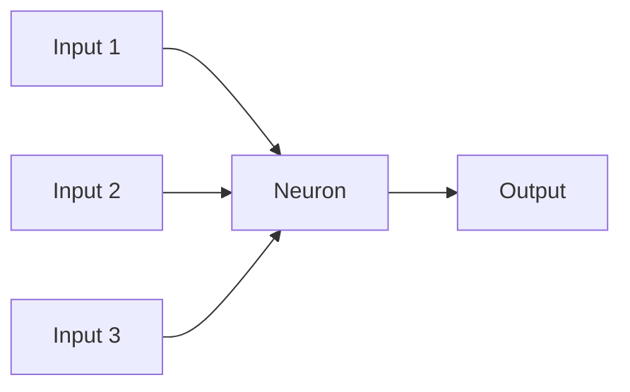
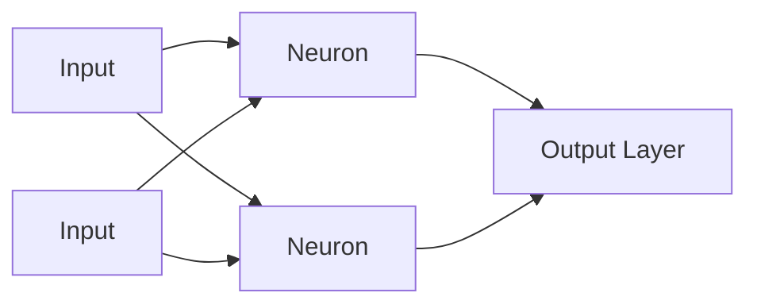

# Neurons

> [!abstract] Definition  
> A **neuron** is a small computational unit inside a neural network. It receives inputs, processes them, and produces an output.

A neural network contains many neurons connected together. Each neuron performs a simple calculation, but many neurons working together can learn complex patterns.

## Basic Idea

A neuron receives one or more inputs.



For example, a neuron might receive:

```text
Input 1 → Hours studied
Input 2 → Attendance
Input 3 → Previous score
```

The neuron combines these inputs and produces an output.

## What Happens Inside a Neuron?

A simplified neuron works like this:

```text
Inputs
  ↓
Multiply by weights
  ↓
Add them together
  ↓
Add a bias
  ↓
Activation function
  ↓
Output
```

The important parts are:

- **Inputs** — information entering the neuron.
    
- **Weights** — values that determine how important each input is.
    
- **Bias** — an additional value that helps shift the result.
    
- **Activation function** — transforms the result.
    
- **Output** — the value produced by the neuron.
    

You don't need to understand the mathematics yet. We'll study weights, biases, and activation functions separately.

## A Simple Example

Imagine a neuron receives two inputs:

```text
Input 1 = 5
Input 2 = 2
```

The neuron has learned:

```text
Weight 1 = 0.8
Weight 2 = 0.3
```

The neuron gives more importance to the first input because its weight is larger.

Conceptually:

```text
Input 1 ──→ Weight ──┐
                     ├──→ Neuron ──→ Output
Input 2 ──→ Weight ──┘
```

The actual calculation is mathematical, but you can currently think of the neuron as a small function that **combines information and produces a new value**.

## Neurons Work Together

A single neuron is usually not very powerful.

The real power comes from connecting many neurons into layers.



A neural network can contain thousands, millions, or even billions of such computational connections.

Together, they can learn complicated patterns.

> [!important] Remember  
> **A neuron is a basic computational unit that receives inputs, combines them using learned values such as weights and a bias, and produces an output.**

The next topic explains the two most important learned values inside a neuron: [[Weights and Biases]].