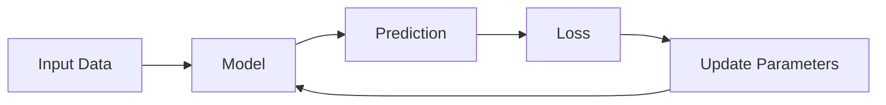

# Parameters

> [!abstract] Definition  
> **Parameters** are the internal values of a machine-learning model that are **learned from data during training**.

In a neural network, the main parameters are **weights and biases**.

```text
Neural Network
│
├── Weights
└── Biases
```

## Parameters and Learning

At the beginning of training, the model's parameters usually do not have useful values.

The model uses them to make a prediction, calculates the loss, and then updates the parameters.



This happens repeatedly until the model learns useful patterns.

For example:

```text
Initial parameters
       ↓
Prediction is poor
       ↓
Calculate loss
       ↓
Update parameters
       ↓
Prediction improves
       ↓
Update again
       ↓
...
```

The learned parameters are what allow the model to behave differently after training.

## Parameters vs Hyperparameters

You will also hear about **hyperparameters**. These are different from parameters.

**Parameters** are learned by the model:

```text
Weights
Biases
```

**Hyperparameters** are settings chosen by the person training the model:

```text
Learning rate
Batch size
Number of training epochs
```

For example, the model learns its weights, but we might choose the learning rate.


|Category|Parameters|Hyperparameters|
|---|---|---|
|Who chooses them?|The model learns them|The engineer chooses them|
|Examples|Weights, biases|Learning rate, batch size|
|Change during training?|Yes|Usually fixed or manually adjusted|


> [!important] Remember  
> **Parameters are the values a model learns during training. In neural networks, weights and biases are the main parameters.**

A simple mental model:

```text
Training Data
     ↓
Model
     ↓
Learn Parameters
     ↓
Trained Model
```

Next: [[Forward Pass]]