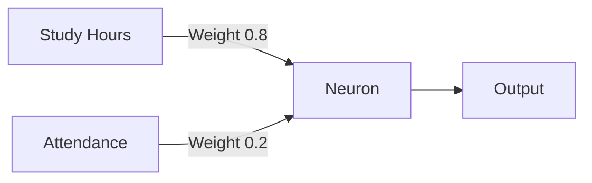
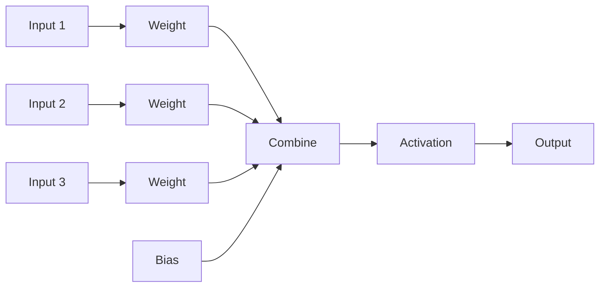

# Weights and Biases

> [!abstract] Definition  
> **Weights and biases are learnable values inside a neural network.** During training, the network adjusts them so that its predictions become better.

You can think of them as the values that allow a neural network to **learn patterns from data**.

## Weights

A **weight** controls how strongly an input influences a neuron.

Suppose a neuron receives two inputs:

```text
Input 1 → Study Hours
Input 2 → Attendance
```

The neuron might have:

```text
Weight 1 = 0.8
Weight 2 = 0.2
```

This means the first input has a stronger influence on the neuron's calculation.



The network doesn't know the correct weights beforehand. **It learns them during training.**

## Bias

A **bias** is another learnable value added to the neuron's calculation.

A simplified calculation looks like:

```text
Input × Weight
      +
Input × Weight
      +
Bias
      ↓
Neuron Output
```

The bias gives the neuron additional flexibility when producing its output.

You can think of it as a value that can **shift the neuron's result**.

## Weights and Biases Together

A simplified neuron looks like this:



The neuron combines the inputs using their weights, adds the bias, and then passes the result through an activation function.

We'll study the activation function later.

## How Do They Learn?

Initially, the weights and biases may contain values that don't produce good predictions.

During training:

```text
Initial Weights & Biases
          ↓
       Prediction
          ↓
          Loss
          ↓
     Calculate Updates
          ↓
Updated Weights & Biases
          ↓
     Better Prediction
```

This process happens repeatedly.

Over time, the network finds values that allow it to make better predictions.

## Parameters

Weights and biases are examples of **parameters**.

```text
Neural Network
│
├── Weights
│
└── Biases
```

Together, these learned values determine much of what the neural network has learned.

> [!important] Remember  
> **Weights control how strongly inputs influence a neuron. Biases give the neuron additional flexibility. Both are learned during training.**

A simple mental model:

**Weights = importance of inputs**

**Bias = adjustment to the neuron's calculation**

https://www.youtube.com/watch?v=nEt5_8V_wpY

Next: [[Layers]]