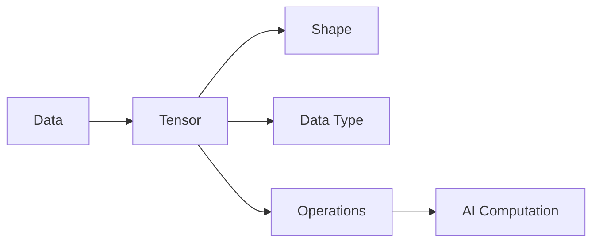

> [!abstract] Purpose  
> This phase introduces **tensors**, the basic data structure used to represent and process data in modern deep-learning systems.

Before working deeply with frameworks such as PyTorch, it is important to understand what tensors are, how they are organized, and why neural networks use them.

---

## Learning Path

### 01. [[Tensors]]

The basic idea of a tensor and why tensors are used in AI.

### 02. [[Tensor Dimensions]]

Understanding the different dimensions of a tensor.

### 03. [[Tensor Shape]]

Understanding how we describe the size and structure of a tensor.

### 04. [[Tensor Data Types]]

Understanding how tensors store different kinds of numerical values.

### 05. [[Tensor Operations]]

Understanding the basic operations we can perform on tensors.

### 06. [[Tensors in AI]]

Understanding how tensors represent real AI data such as images, text, and batches.

---

## Learning Flow

The main idea is:

**Data → Tensor → Tensor Operations → Neural Network Computation**

> [!tip] Learning Goal  
> By the end of this phase, you should understand what a tensor is, how to read its shape and dimensions, and why tensors are the basic building blocks for numerical computation in deep learning.