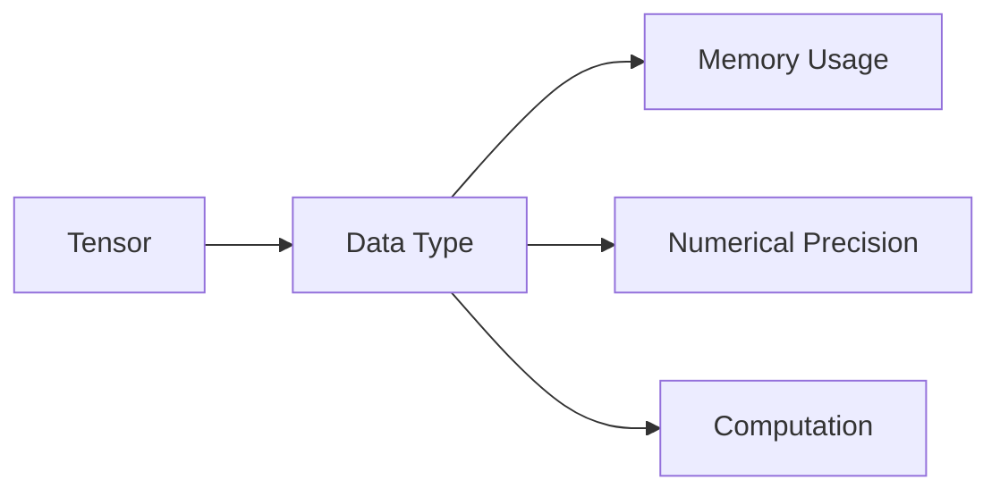

# Tensor Data Types

> [!abstract] Definition  
> A **tensor data type** determines what kind of numbers a tensor stores and how much memory each value uses.

In deep learning, tensors commonly contain numerical values such as integers or floating-point numbers.

For example:

```text
[1, 2, 3, 4]
```

could be stored as integers, while:

```text
[0.25, 0.7, 1.35]
```

could be stored as floating-point numbers.

## Why Data Types Matter

The data type affects two important things:

**Precision** — how accurately a number can be represented.

**Memory usage** — how much memory each value requires.

For example, a tensor using a larger floating-point type generally requires more memory than one using a smaller type.

```text
Larger data type
      ↓
More memory
      ↓
Potentially higher numerical precision

Smaller data type
      ↓
Less memory
      ↓
Potentially lower precision
```

This becomes very important when working with large neural networks and GPUs.

## Common Tensor Data Types

You will commonly encounter types such as:

|Data type|General meaning|
|---|---|
|`int32`|32-bit integer|
|`int64`|64-bit integer|
|`float32`|32-bit floating-point number|
|`float16`|16-bit floating-point number|
|`bfloat16`|16-bit floating-point number designed for efficient AI computation|

For example, a tensor might be:

```text
[1.2, 3.4, 5.6]
```

with:

```text
dtype = float32
```

This means each value is stored using a 32-bit floating-point representation.

## Floating Point in AI

Neural networks perform a lot of mathematical calculations involving decimal numbers.

For example:

```text
0.52
-1.73
2.81
```

Because of this, floating-point data types such as `float32`, `float16`, and `bfloat16` are extremely common in deep learning.

A model might normally use `float32` during training:

```text
float32
   ↓
More memory
   ↓
Good numerical precision
```

But AI systems can sometimes use lower-precision formats:

```text
float16 / bfloat16
   ↓
Less memory
   ↓
Faster computation on supported hardware
```

This idea is closely related to **mixed-precision training**, which you will encounter later when studying AI performance and optimization.

## Data Type and Memory

Suppose we have a tensor containing **1 million values**.

If each value uses 32 bits:

```text
1 million × 32 bits
```

If we use a 16-bit representation instead:

```text
1 million × 16 bits
```

The second tensor requires roughly half as much storage for the numerical values.

This is one reason lower-precision data types are important when working with large AI models.



## Data Type Is Different from Shape

Don't confuse **shape** with **data type**.

For example:

```text
Tensor:
[1.2, 3.4, 5.6]

Shape:
3

Data type:
float32
```

Shape tells us **how the values are organized**.

Data type tells us **how each value is represented**.

```text
Shape     → Structure
Data type → Representation
```

> [!important] Remember  
> **Tensor shape tells us how data is organized, while tensor data type tells us what kind of values the tensor stores and how those values are represented in memory.**

For now, remember the most common types:

```text
int32
int64
float32
float16
bfloat16
```

You will see these frequently when working with **PyTorch, GPUs, model training, and inference**.

Next: [[Tensor Operations]]