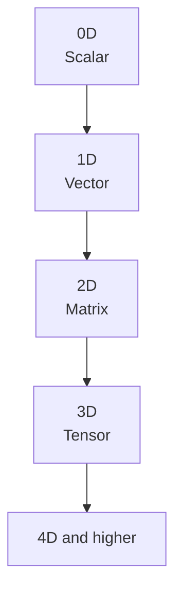

> [!abstract] Definition  
> **Tensor dimensions** describe how many levels of organization a tensor has.

You can think of dimensions as the number of directions in which the data is organized.

## From 0D to Higher Dimensions

A tensor can have different numbers of dimensions.

### 0D — Scalar

A scalar contains a single number.

```text
5
```

It has **0 dimensions** because there is no collection around the number.

### 1D — Vector

A 1D tensor contains a sequence of numbers.

```text
[1, 2, 3, 4]
```

You can think of this as one row of values.

### 2D — Matrix

A 2D tensor contains rows and columns.

```text
[
  [1, 2, 3],
  [4, 5, 6]
]
```

This has **2 dimensions**:

```text
Rows × Columns
2 × 3
```

### 3D Tensor

A 3D tensor can be thought of as multiple 2D matrices stacked together.

```text
[
  [
    [1, 2],
    [3, 4]
  ],

  [
    [5, 6],
    [7, 8]
  ]
]
```

You can visualize it as:



## Dimensions in AI

Real AI data often requires more dimensions.

For example, a color image can be represented using dimensions for:

```text
Height × Width × Channels
```

For example:

```text
224 × 224 × 3
```

The `3` represents the three color channels:

```text
Red
Green
Blue
```

A batch of images adds another dimension:

```text
Batch × Height × Width × Channels
```

For example:

```text
32 × 224 × 224 × 3
```

This could represent **32 images**, each with a height of 224, width of 224, and 3 color channels.


## Dimension vs Number of Values

It is important not to confuse **dimensions** with the number of values.

For example:

```text
[
  [1, 2, 3],
  [4, 5, 6]
]
```

This tensor has:

- **2 dimensions**
    
- **6 values**
    
- **Shape = 2 × 3**
    

So dimensions describe the **structure**, while the number of values tells us **how much data is stored**.

> [!important] Remember  
> **Tensor dimensions describe the number of levels of organization in a tensor.**
> 
> Scalar → 0D  
> Vector → 1D  
> Matrix → 2D  
> Higher-dimensional tensor → 3D, 4D, and beyond

A useful mental model:

```text
0D → One value
1D → A list
2D → A table
3D → A stack of tables
4D → A collection of 3D tensors
```

Next: [[Tensor Shape]]