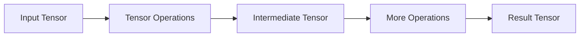
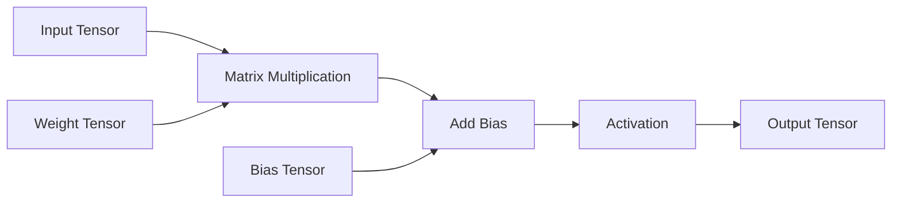
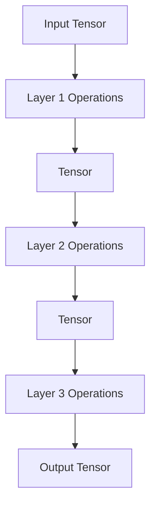

# Tensor Operations

> [!abstract] Definition  
> **Tensor operations** are mathematical or structural operations performed on tensors. Neural networks use these operations constantly to transform input data and perform computations.

A neural network is essentially a large collection of mathematical operations applied to tensors.



## Basic Operations

A tensor can be added, subtracted, multiplied, or divided.

For example:

```text
A = [1, 2, 3]
B = [4, 5, 6]
```

Adding them:

```text
A + B = [5, 7, 9]
```

Multiplication:

```text
A × B = [4, 10, 18]
```

These operations are simple, but neural networks perform enormous numbers of them.

## Matrix Multiplication

One of the most important operations in neural networks is **matrix multiplication**.

For example, a neural network layer can perform something conceptually similar to:

```text
Input
  ↓
Matrix Multiplication
  ↓
Add Bias
  ↓
Activation Function
  ↓
Output
```

This is closely related to the weights and biases we learned about earlier.



Modern GPUs are extremely good at performing these operations in parallel, which is one reason GPUs are so important for AI.

## Element-Wise Operations

Some operations are performed independently on each value.

For example:

```text
A = [1, 2, 3]

A × 2

= [2, 4, 6]
```

Each element is multiplied by `2`.

```text
1 × 2 → 2
2 × 2 → 4
3 × 2 → 6
```

Activation functions such as ReLU can also be applied element by element.

```text
[-2, 3, -1, 5]

ReLU

[0, 3, 0, 5]
```

## Changing Tensor Structure

Tensor operations can also change how data is organized.

For example, a tensor can be **reshaped**.

```text
2 × 3
  ↓
6
```

The same six values can be reorganized into a different shape.

Other common structural operations include:

- Reshape
    
- Flatten
    
- Transpose
    
- Concatenation
    
- Slicing
    

These operations become very common when building neural networks.

## Tensor Operations in a Neural Network

A simplified neural-network layer might look like:

```text
Input Tensor
     ↓
Matrix Multiplication
     ↓
Add Bias
     ↓
Activation
     ↓
Output Tensor
```

And a complete network repeats this idea across multiple layers:



So when you eventually write something like a neural-network model in PyTorch, much of what happens underneath is **tensor computation**.

> [!important] Remember  
> **Tensor operations are the mathematical and structural operations performed on tensors. Neural networks use these operations to transform data and produce predictions.**

The most important operations to recognize for now are:

```text
Addition
Subtraction
Multiplication
Matrix Multiplication
Reshape
Transpose
Concatenation
Slicing
```

Next: [[Tensors in AI]]