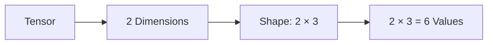
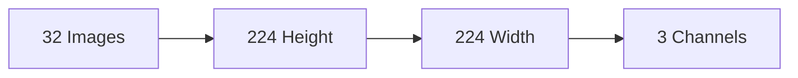

# Tensor Shape

> [!abstract] Definition  
> A tensor's **shape** describes the size of the tensor along each of its dimensions.

Shape tells us **how many values exist along each dimension**.

For example:

```text
[
  [1, 2, 3],
  [4, 5, 6]
]
```

This tensor has:

```text
Shape = 2 × 3
```

It has **2 rows** and **3 columns**.

## Shape and Dimensions

Shape and dimensions are closely related, but they are not the same thing.

Consider:

```text
Shape = 2 × 3
```

This tells us:

- The tensor has **2 dimensions**.
    
- The first dimension has size **2**.
    
- The second dimension has size **3**.
    
- The tensor contains **6 values**.
    



So you can think of it this way:

> **Dimensions tell us how many axes the tensor has. Shape tells us the size of each axis.**

## Simple Examples

### 1D Tensor

```text
[10, 20, 30, 40]
```

Shape:

```text
4
```

There is one dimension containing 4 values.

### 2D Tensor

```text
[
  [1, 2, 3],
  [4, 5, 6]
]
```

Shape:

```text
2 × 3
```

There are 2 rows and 3 columns.

### 3D Tensor

Imagine three 2 × 2 matrices:

```text
Shape = 3 × 2 × 2
```

This means:

```text
3 matrices
  ×
2 rows
  ×
2 columns
```

Total values:

```text
3 × 2 × 2 = 12
```

## Shape in AI

Shape becomes especially important when working with real AI data.

For example, suppose we have a batch of images:

```text
32 × 224 × 224 × 3
```

A common interpretation is:

```text
32  → number of images
224 → image height
224 → image width
3   → color channels
```

So:

```text
Batch × Height × Width × Channels
```



The exact dimension ordering can differ between frameworks or models, so when working with real systems, always check what shape the particular model expects.

## Shape Changes

During AI computation, tensors are often **reshaped, flattened, or rearranged** so that different operations can work with them.

For example:

```text
2 × 3
```

can contain the same six values as:

```text
6
```

The values have not necessarily changed; their **organization** has changed.

```text
2 × 3
  ↓
Reshape
  ↓
6
```

This becomes especially important when working with neural-network layers and PyTorch.

> [!important] Remember  
> **Tensor shape describes the size of a tensor along each dimension.**

Keep these three ideas separate:

```text
Dimensions → How many axes?

Shape      → Size of each axis?

Values     → How many numbers?
```

For example:

```text
Shape: 2 × 3

Dimensions = 2
Values     = 6
```

Next: [[Tensor Data Types]]