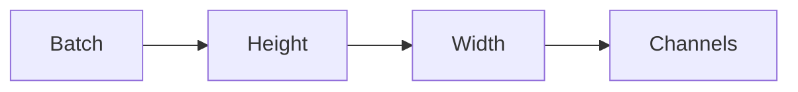
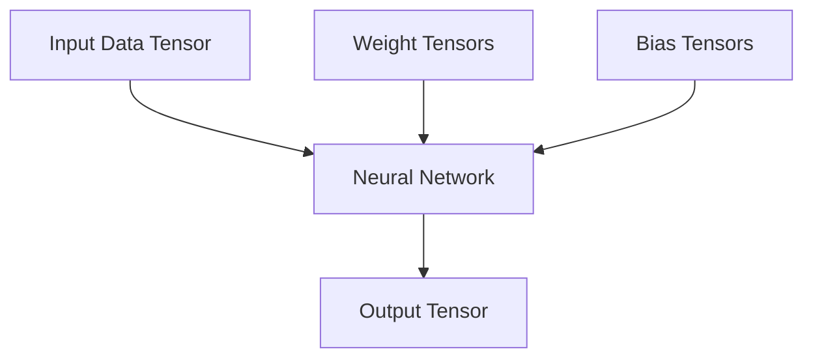

# Tensors in AI

> [!abstract] Definition  
> In AI systems, **tensors are the main numerical representation used to store data and perform computations**.

We have seen that tensors can have different dimensions, shapes, and data types. Now we can connect those ideas to real AI systems.

The important thing to understand is:

> **AI data eventually becomes numbers, and those numbers are usually represented as tensors.**

## Images

An image is made of pixels.

For a simple grayscale image, each pixel can be represented by a number describing its brightness.

```text
Image
  ↓
Pixel Values
  ↓
Tensor
  ↓
Neural Network
```

A small grayscale image might look like:

```text
[
  [  0,  50, 100 ],
  [100, 150, 200 ],
  [200, 255, 255 ]
]
```

This is a **2D tensor**.

For a color image, we normally need additional information for the color channels.

A simplified representation could have the shape:

```text
Height × Width × Channels
```

For example:

```text
224 × 224 × 3
```

The `3` represents:

```text
Red
Green
Blue
```

## Batches of Images

AI models usually process multiple examples together rather than one at a time.

Suppose we have 32 images:

```text
32 × 224 × 224 × 3
```

The first dimension represents the **batch**.

```text
32  → Images
224 → Height
224 → Width
3   → Channels
```

So the tensor contains the data for 32 images.



## Text

Text also needs to become numbers before a neural network can process it.

For example:

```text
"AI is useful"
```

is converted into **tokens**.

Those tokens are then represented numerically.

```text
Text
 ↓
Tokens
 ↓
Numbers
 ↓
Tensors
 ↓
Neural Network
```

For example, a simplified representation might look like:

```text
[125, 42, 981]
```

Real language models use more sophisticated representations, such as **embeddings**, but the important idea for now is that the model ultimately works with numerical tensors.

## Audio

Audio can also be represented as numbers.

A recording can be represented as a sequence of audio samples:

```text
Audio
  ↓
Samples
  ↓
Numbers
  ↓
Tensor
  ↓
AI Model
```

So images, text, and audio may look completely different to us, but they can all eventually be represented using tensors.

## Model Parameters

Tensors are also used to store the **parameters of neural networks**.

Remember:

```text
Parameters
├── Weights
└── Biases
```

These values are commonly stored as tensors.

So a neural network might contain:



This is an important connection:

> **Tensors are used both for the data going into a model and the parameters inside the model.**

## Tensors Connect Everything

You can now see why tensors are so important in AI engineering.

```text
Image ──────┐
Text ───────┤
Audio ──────┤
             ↓
          Tensors
             ↓
      Neural Network
             ↓
       Tensor Operations
             ↓
          Prediction
```

The same basic tensor concept appears throughout deep learning frameworks such as **PyTorch** and **TensorFlow**.

> [!important] Remember  
> **Tensors are the common numerical language of deep learning.**
> 
> Data becomes tensors. Model parameters are stored as tensors. Neural networks perform operations on tensors. The results are also tensors.

---

## Phase 4 Summary

You now have the basic foundation for understanding tensors:

```text
Tensor
  ↓
Dimensions
  ↓
Shape
  ↓
Data Type
  ↓
Tensor Operations
  ↓
Tensors in AI
```

The next phase will use these concepts in practice with **[[05 — Deep Learning Frameworks]]**, starting with **PyTorch**.