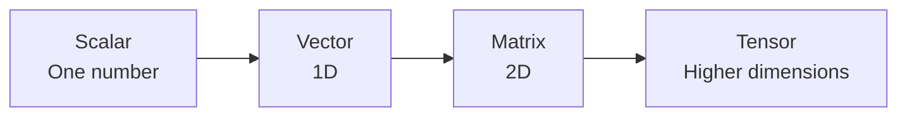

# Tensors

> [!abstract] Definition  
> A **tensor** is a data structure used to store numbers in an organized way. In deep learning, tensors are used to represent data, model parameters, and intermediate results.

If you have worked with programming before, you can think of a tensor as a more general version of an **array**.

For example, a single number can be represented as a tensor:

```text
5
```

A list of numbers can be represented as a tensor:

```text
[1, 2, 3, 4]
```

And a table of numbers can also be represented as a tensor:

```text
[
  [1, 2, 3],
  [4, 5, 6]
]
```

The important idea is that tensors can organize numbers across multiple dimensions.

## From Number to Tensor

You can gradually build the idea like this:

```text
Scalar
  ↓
[1, 2, 3]
  ↓
[
  [1, 2, 3],
  [4, 5, 6]
]
  ↓
Higher-dimensional tensor
```

A single number is often called a **scalar**.

A one-dimensional collection of numbers is often called a **vector**.

A two-dimensional collection is often called a **matrix**.

Tensors generalize this idea to any number of dimensions.



In practice, the word **tensor** is often used for all of these in deep-learning frameworks.

## Tensors in Neural Networks

Neural networks work with numbers.

When we give a neural network an image, for example, the image must be represented numerically.

A simplified example:

```text
Image
  ↓
Pixel values
  ↓
Tensor
  ↓
Neural Network
  ↓
Output
```

The same idea applies to other types of data.

```text
Text   → numbers → tensor
Image  → pixels  → tensor
Audio  → samples → tensor
```

Tensors are therefore the common numerical representation that allows different types of data to be processed by AI systems.

## Tensors Also Store Model Values

Tensors are not only used for input data.

Neural-network **weights and biases** are also stored as tensors in frameworks such as PyTorch.

For example:

```text
Input Tensor
      ↓
Weight Tensor
      ↓
Mathematical Operations
      ↓
Output Tensor
```

This is one reason tensors are so important in deep learning.

> [!important] Remember  
> **A tensor is an organized collection of numbers used to represent data and perform numerical computation in AI systems.**

For now, don't worry about complicated tensor mathematics. The next topic focuses on one of the most important properties of a tensor: its **dimensions**.

Next: [[Tensor Dimensions]]   